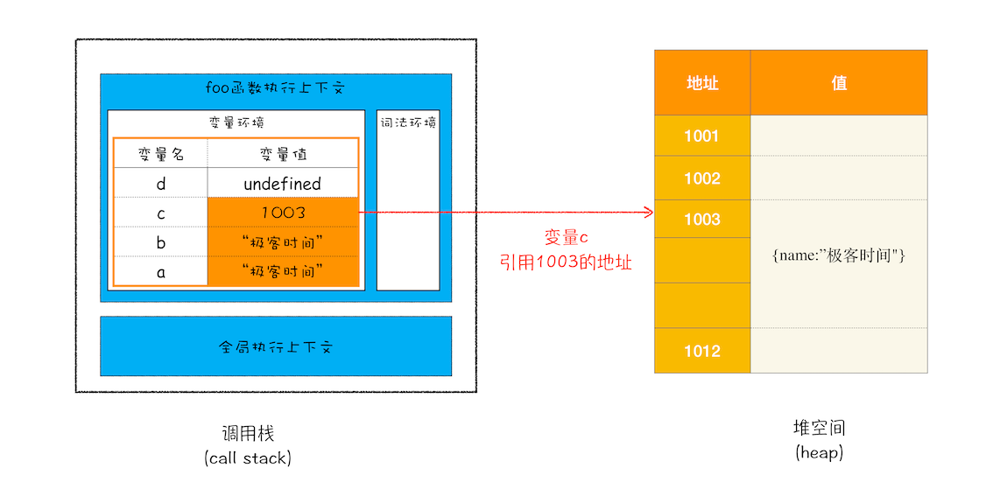
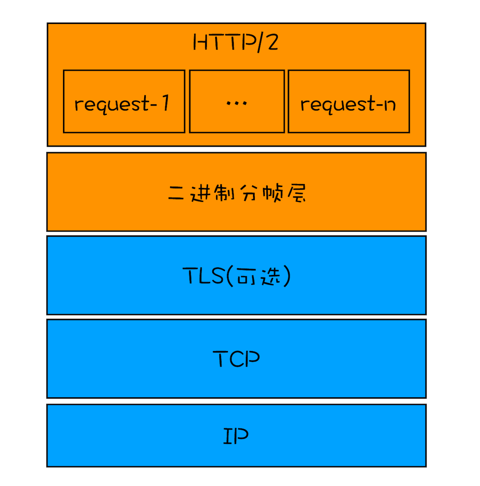

## 背景

### 开篇词 | 参透了浏览器的工作原理，你就能解决 80%的前端难题

我从浏览器的发展历程中梳理出了三个大的进化路线

1. 应用程序 Web 化
2. Web 应用移动化
   1. PWA
3. Web 操作系统化
   1. ChromeOS

为什么要学习浏览器：

1. 准确评估 Web 开发项目的可行性
2. 从更高维度审视页面
3. 在快节奏的技术迭代中把握本质
   1. Node.js 是基于 Chrome 的 JavaScript 引擎 V8 来实现的，它的特点是可以脱离浏览器环境来执行 JavaScript

了解浏览器是如何工作的，能让你站在更高维度去理解前端。

### 01 | Chrome 架构：仅仅打开了 1 个页面，为什么有 4 个进程？

#### 线程 VS 进程

一个进程就是一个程序的运行实例。详细解释就是，启动一个程序的时候，**操作系统会为该程序创建一块内存，用来存放代码、运行中的数据和一个执行任务的主线程，我们把这样的一个运行环境叫进程。**

1. 进程中的任意一线程执行出错，都会导致整个进程的崩溃。
2. 线程之间共享进程中的数据。
3. 当一个进程关闭之后，操作系统会回收进程所占用的内存。
   1. 即使其中任意线程因为操作不当导致内存泄漏，当进程退出时，这些内存也会被正确回收。
   2. 比如浏览器插件内存泄漏，但是关闭浏览器进程时，这些内存会被系统回收掉
4. 进程之间的内容相互隔离。
   1. 如果进程之间需要进行数据的通信，这时候，就需要使用用于进程间通信（IPC）的机制了。

#### 单进程浏览器时代

单进程浏览器是指浏览器的所有功能模块都是运行在同一个进程里，这些模块包含了**网络、插件、JavaScript 运行环境、渲染引擎和页面**等。其实早在 2007 年之前，市面上浏览器都是单进程的。

如此多的功能模块运行在一个进程里，是导致单进程浏览器不稳定、不流畅和不安全的一个主要因素。下面我就来一一分析下出现这些问题的原因。

- 不稳定，任意地方的崩溃都会导致整个浏览器的崩溃
- 不流畅，同一时刻，只能有一个模块执行，比如一个死循环就会卡死页面
- 不安全，插件和脚本可以获取系统级别的一些资源和权限，

#### 早期多进程浏览器时代

一个进程就是一个程序的运行实例，在 chrome 中，目前是多进程的，也就是说，一个 chrome 会启动过个应用，比如网络应用，插件应用，浏览器主进程等等。

- 如何解决不稳定：进程相互隔离，互补干扰
- 如何解决不流畅：进程相互隔离，各自运行
- 如何解决不安全：进程相互隔离，各自有安全沙箱

#### 目前多进程架构

最新的 Chrome 浏览器包括：

- 1 个浏览器（Browser）主进程、
- 1 个 GPU 进程、
- 1 个网络（NetWork）进程、
- 多个渲染进程和多个插件进程。

- 浏览器进程。主要负责界面显示、用户交互、子进程管理，同时提供存储等功能。
-
- 渲染进程：核心任务是将 HTML、CSS 和 JavaScript 转换为用户可以与之交互的网页，排版引擎 Blink 和 JavaScript 引擎 V8 都是运行在该进程中，默认情况下，Chrome 会为每个 Tab 标签创建一个渲染进程。出于安全考虑，渲染进程都是运行在沙箱模式下。
-
- GPU 进程。其实，Chrome 刚开始发布的时候是没有 GPU 进程的。而 GPU 的使用初衷是为了实现 3D CSS 的效果，只是随后网页、Chrome 的 UI 界面都选择采用 GPU 来绘制，这使得 GPU 成为浏览器普遍的需求。最后，Chrome 在其多进程架构上也引入了 GPU 进程。
  - CPU 适用于通用计算、顺序执行和依赖于单线程性能的任务，而 GPU 适用于并行计算、向量操作、图形渲染和需要大规模数据处理的任务。
  - GPU(Graphics Processing Unit), CPU(Central Processing Unit)
  - GPU 在渲染方面比 CPU 执行效率高，主要得益于其并行处理能力、SIMD 架构、高存储带宽、专门优化的图形渲染管线以及硬件加速等特点。
-
- 网络进程：主要负责页面的网络资源加载，之前是作为一个模块运行在浏览器进程里面的，直至最近才独立出来，成为一个单独的进程。
-
- 插件进程。主要是负责插件的运行，因插件易崩溃，所以需要通过插件进程来隔离，以保证插件进程崩溃不会对浏览器和页面造成影响。

不过凡事都有两面性，虽然多进程模型提升了浏览器的稳定性、流畅性和安全性，但同样不可避免地带来了一些问题：

- 更高的资源占用。因为每个进程都会包含公共基础结构的副本（如 JavaScript 运行环境），这就意味着浏览器会消耗更多的内存资源。
- 更复杂的体系架构。浏览器各模块之间耦合性高、扩展性差等问题，会导致现在的架构已经很难适应新的需求了。

#### 未来面向服务的架构

为了解决这些问题，在 2016 年，Chrome 官方团队使用“面向服务的架构”（Services Oriented Architecture，简称 SOA）的思想设计了新的 Chrome 架构。也就是说 Chrome 整体架构会朝向现代操作系统所采用的“面向服务的架构” 方向发展，原来的各种模块会被重构成独立的服务（Service），每个服务（Service）都可以在独立的进程中运行，访问服务（Service）必须使用定义好的接口，通过 IPC 来通信，从而构建一个更内聚、松耦合、易于维护和扩展的系统

#### 即使是如今的多进程架构，我偶尔还会碰到一些由于单个页面卡死最终崩溃导致所有页面崩溃的情况，请问这是什么原因呢

Chrome 的默认策略是，每个标签对应一个渲染进程。但是如果从一个页面打开了新页面，而新页面和当前页面属于同一站点时，那么新页面会复用父页面的渲染进程。

官方把这个默认策略叫 process-per-site-instance。

直白的讲，就是如果几个页面符合同一站点，那么他们将被分配到一个渲染进程里面去。

所以，这种情况下，一个页面崩溃了，会导致同一站点的页面同时崩溃，因为他们使用了同一个渲染进程。

为什么要让他们跑在一个进程里面呢？

因为在一个渲染进程里面，他们就会共享 JS 的执行环境，也就是说 A 页面可以直接在 B 页面中执行脚本。因为是同一家的站点，所以是有这个需求的。

##### 那为什么有的时候同一站点下的两个 tab 就是两个进程呢，这个是由什么来控制的？

- 如果你直接从地址栏输入地址的，即便同一站点，也会使用不同的渲染进程！
- 如果代码设置了一些安全属性，即便同一站，也会使用不同的进程！

#### 所有的 iframe 标签都会创建一个新的渲染进程吗？

iframe 没有单独标签，是潜入在其它页面里面的，比如一个页面嵌入了三个不同域名的 iframe，那么这个页面就会拥有四个渲染进程

#### 我开了一个页面，在 chrome task manager 里六个进程，而在 windows 里有九个 chrome 相关进程？

上面提到的四个进程是必须的，但是通常情况下，会有更多进程，如扩展进程，代理进程，iframe 进程，还会一些如压缩，视频，音频等功能进程，这个根据每个人的电脑环境，页面环境不同而不同！

另外 Chrome 有一些辅助进程在任务管理器并没有显示出来的。比如预渲进程，会有一个额外的渲染进程，提前开启，等有渲染进程需求的时候，就直接使用改进程，这样就省去了创建进程的时间了！

另外：浏览器进程 网络进程，GPU 进程都是共同的，不会随着页面打开的增多，而增多

#### 进程其实是一个程序的运行实例，那 chrome 浏览器打开是不是实际上打开父进程，然后浏览器里面打开的页面是相当于子进程？

对的，其它进程都是由浏览器进程创建

### 02 | TCP 协议：如何保证页面文件能被完整送达浏览器？

在衡量 Web 页面性能的时候有一个重要的指标叫“FP（First Paint）”，是指从页面加载到首次开始绘制的时长。

在网络中，一个文件通常会被拆分为很多数据包来进行传输，而数据包在传输过程中又有很大概率丢失或者出错。那么如何保证页面文件能被完整地送达浏览器呢？

对于浏览器请求，或者邮件这类要求数据传输可靠性（reliability）的应用，如果使用 UDP 来传输会存在两个问题：

- 数据包在传输过程中容易丢失；
- 大文件会被拆分成很多小的数据包来传输，这些小的数据包会经过不同的路由，并在不同的时间到达接收端，而 UDP 协议并不知道如何组装这些数据包，从而把这些数据包还原成完整的文件。

基于这两个问题，我们引入 TCP 了。TCP（Transmission Control Protocol，传输控制协议）是一种**面向连接的、可靠的、基于字节流**的传输层通信协议。相对于 UDP，TCP 有下面两个特点:

- 对于数据包丢失的情况，TCP 提供重传机制；（发出去之后，长时间没有收到信息，则重发）
- TCP 引入了数据包排序机制，用来保证把乱序的数据包组合成一个完整的文件。

#### 现在的浏览器可以同时打开多个页签，他们端口一样吗？如果一样，数据怎么知道去哪个页签？

端口一样的，网络进程知道每个 tcp 链接所对应的标签是那个，所以接收到数据后，会把数据分发给对应的渲染进程

#### tcp 传送数据时 浏览器端就做渲染处理了么？如果前面数据包丢了 后面数据包先来是要等么？类似的那种实时渲染怎么处理？针对数据包的顺序性？

接收到 http 响应头中的 content-type 类型时就开始准备渲染进程了，

响应体数据一旦接受到便开始做 DOM 解析了！

基于 http 不用担心数据包丢失的问题，因为丢包和重传都是在 tcp 层解决的。http 能保证数据按照顺序接收的！

#### Provisional headers are shown...

- 出现这种 case，一种情况是命中了强制缓存，请求压根就没有发出
- 还有一种情况就是 url 是个非法的，同样是

### 03 | HTTP 请求流程：为什么很多站点第二次打开速度会很快？

浏览器端发起 HTTP 请求流程

1. 构建请求
   1. 首先，浏览器构建请求行信息，构建好后，浏览器准备发起网络请求。
2. 查找缓存
   1. 这里包含 dns、资源缓存都有
3. 准备 ip 地址和端口，先请求 dns 获取 ip 地址
   1. 因为浏览器使用 HTTP 协议作为应用层协议，用来封装请求的文本信息；并使用 TCP/IP 作传输层协议将它发到网络上，所以在 HTTP 工作开始之前，浏览器需要通过 TCP 与服务器建立连接。
   2. 也就是说先建立 tcp，才是 http 建立
4. 等待 tcp 队列
   1. 由于浏览器同时只能有 6 个 tcp 连接，因此如果超过 6 个，则需要等待
5. 建立 TCP 连接
6. 发送 http 请求，一旦 tcp 建立连接，浏览器就可以和服务器进行通信了
   1. 请求行：首先浏览器会向服务器发送请求行，它包括了请求方法、请求 URI（Uniform Resource Identifier）和 HTTP 版本协议。
   2. 请求头：在浏览器发送请求行命令之后，还要以请求头形式发送其他一些信息，把浏览器的一些基础信息告诉服务器。比如包含了浏览器所使用的操作系统、浏览器内核等信息，以及当前请求的域名信息、浏览器端的 Cookie 信息，等等。
   3. 请求体：则是 post 方法，会发送
7. 返回请求
   1. 当服务器处理完后，就可以返回数据给浏览器了
   2. 可以使用 `curl -i  https://time.geekbang.org/` 来查看返回响应行、响应头和响应体的数据，
   3. 虽然会通过一次请求返回响应行，响应头，响应体，但解析是有顺序的
8. 断开请求
   1. 通常情况下，一旦服务器向客户端返回了请求数据，它就要关闭 TCP 连接。不过如果浏览器或者服务器在其头信息中加入了：`keep-alive` 那么 tcp 连接就会在发送后仍然保持打开状态。
9. 重定向
   1. `curl -I geekbang.org` -I 表示只需要获取响应头和响应行数据，而不需要获取响应体的数据
   2. 响应行返回的状态码是 301 永久重定向，状态 301 就是告诉浏览器，我需要重定向到另外一个网址，而需要重定向的网址正是包含在响应头的 Location 字段中，接下来，浏览器获取 Location 字段中的地址，并使用该地址重新导航，这就是一个完整重定向的执行流程。
   3. 302 是临时重定向，
   4. 不过也不要认为这种跳转是必然的。如果你打开` https://12306.cn`，你会发现这个站点是打不开的。这是因为 12306 的服务器并没有处理跳转，也就是说匹配到这个域名后，服务器没有做 301 或者 302 处理，所以必须要手动输入完整的 `https://www.12306.cn` 才能打开页面。

#### 为什么很多站点第二次打开速度会很快？

- DNS 缓存和页面资源缓存这两块数据是会被浏览器缓存的。

当服务器返回 HTTP 响应头给浏览器时，浏览器是通过响应头中的 Cache-Control 字段来设置是否缓存该资源。通常，我们还需要为这个资源设置一个缓存过期时长，而这个时长是通过 Cache-Control 中的 Max-age 参数来设置的，比如上图设置的缓存过期时间是 2000 秒。

```js
Cache-Control:Max-age=2000
```

但如果缓存过期了，浏览器则会继续发起网络请求，并且在 HTTP 请求头中带上：

```js
If-None-Match:"4f80f-13c-3a1xb12a"
```

服务器收到请求头后，会根据 If-None-Match 的值来判断请求的资源是否有更新。如果没有更新，就返回 304 状态码，相当于服务器告诉浏览器：“这个缓存可以继续使用，这次就不重复发送数据给你了。”

如果资源有更新，服务器就直接返回最新资源给浏览器。

#### cookie 字段是如何写到浏览器里的

1. 服务器接收到浏览器提交的信息之后，查询后台，验证用户登录信息是否正确，如果正确的话，会生成一段表示用户身份的字符串，并把该字符串写到响应头的 Set-Cookie 字段里，如下所示，然后把响应头发送给浏览器。
2. 浏览器在接收到服务器的响应头后，开始解析响应头，如果遇到响应头里含有 Set-Cookie 字段的情况，浏览器就会把这个字段信息保存到本地。比如把 UID=3431uad 保持到本地。

其实就是浏览器和服务器分别根据 请求头、响应头里的数据进行操作对应数据而已。


#### 在浏览器中访问的时候打开 network 面板，发现缓存的来源有的 from disk 有的是 from memory。对于资源什么情况下缓存到硬盘什么时候缓存到内存

- 缓存控制头：服务器可以通过响应头中的缓存控制字段来指定资源的缓存策略。常用的字段包括 Cache-Control 和 Expires。这些字段可以告诉浏览器资源在何时过期以及是否可以缓存。如果服务器指定了缓存控制头，并且浏览器支持并遵循这些指令，那么资源可能会被缓存到硬盘或内存。

- 资源大小：通常来说，较小的资源更有可能被缓存到内存中，而较大的资源则更可能被缓存到硬盘中。这是因为内存的读取速度比硬盘要快得多，对于小型资源，从内存中读取比从硬盘中读取更快。

- 硬盘缓存策略：浏览器通常会将一部分缓存资源存储在硬盘上，以便在需要时可以快速获取。具体的硬盘缓存策略可能因浏览器的不同而有所差异。有些浏览器可能会将缓存的资源直接存储在硬盘上，而有些浏览器则可能会将缓存的资源存储在临时文件夹中。

- 内存缓存限制：浏览器对内存缓存大小有一定的限制。当缓存的资源超过了这个限制时，浏览器可能会将一部分资源从内存中转移到硬盘上，以释放内存空间。

### 04 | 导航流程：从输入 URL 到页面展示，这中间发生了什么？

其中涉及到了网络、操作系统、Web 等一系列的知识。

整个过程需要各个进程的配合，因此需要先了解下各个进程

- 浏览器进程主要负责用户交互、子进程管理和文件储存等功能。
- 网络进程是面向渲染进程和浏览器进程等提供网络下载功能。
- 渲染进程的主要职责是把从网络下载的 HTML、JavaScript、CSS、图片等资源解析为可以显示和交互的页面。因为渲染进程所有的内容都是通过网络获取的，会存在一些恶意代码利用浏览器漏洞对系统进行攻击，所以运行在渲染进程里面的代码是不被信任的。这也是为什么 Chrome 会让渲染进程运行在安全沙箱里，就是为了保证系统的安全。

1. 首先，浏览器进程接收到用户输入的 URL 请求，浏览器进程便将该 URL 转发给网络进程。
2. 然后，在网络进程中发起真正的 URL 请求。
3. 接着网络进程接收到了响应头数据，便解析响应头数据，并将数据转发给浏览器进程。
4. 浏览器进程接收到网络进程的响应头数据之后，发送“提交导航 (CommitNavigation)”消息到渲染进程；
5. 渲染进程接收到“提交导航”的消息之后，便开始准备接收 HTML 数据，接收数据的方式是直接和网络进程建立数据管道；
6. 最后渲染进程会向浏览器进程“确认提交”，这是告诉浏览器进程：“已经准备好接受和解析页面数据了”。
7. 浏览器进程接收到渲染进程“提交文档”的消息之后，便开始移除之前旧的文档，然后更新浏览器进程中的页面状态。

#### 从输入 URL 到页面展示

1. 用户输入
   1. 当用户在地址栏中输入一个查询关键字时，地址栏会判断输入的关键字是搜索内容，还是请求的 URL。
      1. 如果是搜索内容，地址栏会使用浏览器默认的搜索引擎，来合成新的带搜索关键字的 URL。
      2. 如果判断输入内容符合 URL 规则，比如输入的是 time.geekbang.org，那么地址栏会根据规则，把这段内容加上协议，合成为完整的 URL，
      3. 注意：此过程都是在底层做的，用户侧，不点击回车是看不到的
   2. 点击回车后
      1. 浏览器还给了当前页面一次执行 beforeunload 事件的机会，beforeunload 事件允许页面在退出之前执行一些数据清理操作，还可以询问用户是否要离开当前页面，比如当前页面可能有未提交完成的表单等情况，因此用户可以通过 beforeunload 事件来取消导航，让浏览器不再执行任何后续工作。
      2. 此时注意看，标签页上的图标便进入了加载状态。但此时图中页面显示的依然是之前打开的页面内容，并没立即替换为极客时间的页面。因为需要等待提交文档阶段，页面内容才会被替换。
2. URL 请求过程

   1. 这时，浏览器进程会通过进程间通信（IPC）把 URL 请求发送至网络进程，网络进程接收到 URL 请求后，会在这里发起真正的 URL 请求流程。那具体流程是怎样的呢？
   2. 网络进程会查找本地缓存是否缓存了该资源，有则直接返回
   3. 如果没有缓存。则开始发起 dns 解析获取 ip 地址，如果请求协议是 HTTPS，那么还需要建立 TLS 连接。
   4. 然后接下来就是 TCP 连接，**连接建立之后，浏览器端会构建请求行、请求头等信息**，并把和该域名相关的 Cookie 等数据附加到请求头中，然后向服务器发送构建的请求信息。
   5. 服务器接收到请求信息后，会根据请求信息生成响应数据（包括响应行、响应头和响应体等信息），并发给网络进程。等网络进程接收了响应行和响应头之后，就开始解析响应头（响应行和响应头）的内容了。
   6. 如果发现返回的状态码是 301 或者 302，那么说明服务器需要浏览器重定向到其他 URL，这时网络进程会从响应头的 Location 字段里面读取重定向的地址，然后再发起新的 HTTP 或者 HTTPS 请求，一切又重头开始了。
   7. 如果是响应码是 200，则可以继续向下处理请求了
   8. 响应数据类型处理
      1. URL 请求的数据类型，有时候是一个下载类型，有时候是正常的 HTML 页面，那么浏览器是如何区分它们呢？
      2. 答案是 Content-Type。Content-Type 是 HTTP 头中一个非常重要的字段， 它告诉浏览器服务器返回的响应体数据是什么类型，然后浏览器会根据 Content-Type 的值来决定如何显示响应体的内容。
      3. 所以，不同 Content-Type 的后续处理流程也截然不同。如果 Content-Type 字段的值被浏览器判断为下载类型，那么该请求会被提交给浏览器的下载管理器，同时该 URL 请求的导航流程就此结束。但如果是 HTML，那么浏览器则会继续进行导航流程。由于 Chrome 的页面渲染是运行在渲染进程中的，所以接下来就需要准备渲染进程了。

3. 准备渲染进程
   1. 默认情况下，一个 tab 就是一个渲染进程，但是如果是同一个站点，则会复用同一个渲染进程，在任务管理器中，可以看到 多个 tab 共用同一个渲染进程。
   2. 同一个站点，根域名 + 协议，不区分子域名和端口
4. 提交文档，所谓提交文档，就是指浏览器进程将网络进程接收到的 HTML 数据提交给渲染进程，具体流程是这样的：
   1. 首先当浏览器进程接收到网络进程的响应头数据之后，便向渲染进程发起“提交文档”的消息；
   2. 渲染进程接收到“提交文档”的消息后，会和网络进程建立传输数据的“管道”；
   3. 等文档数据传输完成之后，渲染进程会返回“确认提交”的消息给浏览器进程；
   4. 浏览器进程在收到“确认提交”的消息后，会更新浏览器界面状态，包括了安全状态、地址栏的 URL、前进后退的历史状态，并更新 Web 页面。
5. 接下来开始渲染页面
   1. 一旦文档被提交，渲染进程便开始页面解析和子资源加载了
   2. 构建 DOM 树，这是因为浏览器无法直接理解和使用 HTML，所以需要将 HTML 经过 htmp 解析器转换为浏览器能够理解的结构——DOM 树。控制台 document 可以看到，注意 DOM 和 HTML 内容几乎是一样的，但是和 HTML 不同的是，DOM 是保存在内存中树状结构，可以通过 JavaScript 来查询或修改其内容。
   3. 样式计算
      1. 把 CSS 转换为浏览器能够理解的结构，浏览器也是无法直接理解这些纯文本的 CSS 样式，所以当渲染引擎接收到 CSS 文本时，会执行一个转换操作，将 CSS 文本转换为浏览器可以理解的结构——styleSheets。可以通过 document.styleSheets 看到，你只需要知道渲染引擎会把获取到的 CSS 文本全部转换为 styleSheets 结构中的数据，并且该结构同时具备了查询和修改功能，这会为后面的样式操作提供基础。
      2. 这个过程还会把 css 的很多属性标准化，比如 em->px，blod->700，颜色改为 rgb 等
      3. 计算每个 dom 树中每个结点的具体样式，根据继承和成叠规则，继承和来源，可以通过 styles 标签进行查看
   4. 布局阶段
      1. 有了 dom 和样式，还需要 需要计算出 DOM 树中可见元素的几何位置，我们把这个计算过程叫做布局
      2. 创建布局树，所以在显示之前，我们还要额外地构建一棵只包含可见元素布局树。
         1. 遍历 dom 树，然后把显示的节点都加到布局树中
      3. 布局计算，现在我们有了一棵完整的布局树。那么接下来，就要计算布局树节点的坐标位置了，然后重新写入到布局树中
      4. 前面布局树，即使输入又是输出，针对这个问题，Chrome 团队正在重构布局代码，下一代布局系统叫 LayoutNG，试图更清晰地分离输入和输出，从而让新设计的布局算法更加简单。
   5. 分层
      1. 因为页面中有很多复杂的效果，如一些复杂的 3D 变换、页面滚动，或者使用 z-indexing 做 z 轴排序等，为了更加方便地实现这些效果，渲染引擎还需要为特定的节点生成专用的图层，并生成一棵对应的图层树（LayerTree），在浏览器控制面板上，可以查看 layers
      2. 浏览器的页面实际上被分成了很多图层，这些图层叠加后合成了最终的页面。通常情况下，并不是布局树的每个节点都包含一个图层
         1. 第一点，拥有层叠上下文属性的元素会被提升为单独的一层。比如明确定位的元素、定义透明属性的元素，使用 css 滤镜的元素
         2. 第二点，需要剪裁（clip）的地方也会被创建为图层。比如滚动溢出的情况，
   6. 图层绘制
      1. 试想一下，如果给你一张纸，让你先把纸的背景涂成蓝色，然后在中间位置画一个红色的圆，最后再在圆上画个绿色三角形。你会怎么操作呢？
      2. 渲染引擎实现图层的绘制与之类似，会把一个图层的绘制拆分成很多小的绘制指令，然后再把这些指令按照顺序组成一个待绘制列表
         1. 绘制列表中的指令其实非常简单，就是让其执行一个简单的绘制操作，比如绘制粉色矩形或者黑色的线等。而绘制一个元素通常需要好几条绘制指令，因为每个元素的背景、前景、边框都需要单独的指令去绘制。所以在图层绘制阶段，输出的内容就是这些待绘制列表。
         2. 可以在 layers 图层面板，选择左侧的 document，可以看到对应绘制指令
   7. 栅格化操作
      1. 绘制列表只是用来记录绘制顺序和绘制指令的列表，而实际上绘制操作是由渲染引擎中的合成线程来完成的。你可以结合下图来看下渲染主线程和合成线程之间的关系：
      2. 当图层的绘制列表准备好之后，主线程会把该绘制列表提交（commit）给合成线程，那么接下来合成线程是怎么工作的呢？
      3. 合成线程会将图层划分为图块（tile），这些图块的大小通常是 256x256 或者 512x512
      4. 然后合成线程会按照视口附近的图块来优先生成位图，实际生成位图的操作是由栅格化来执行的。所谓栅格化，是指将图块转换为位图。而图块是栅格化执行的最小单位。渲染进程维护了一个栅格化的线程池，所有的图块栅格化都是在线程池内执行的
         1. 将图块转换为位图可以提高渲染性能、加速图像显示（gpu）、精确呈现细节，并且支持图像处理和滤镜效果
   8. 合成与显示
      1. 一旦所有图块都被光栅化，合成线程就会生成一个绘制图块的命令——“DrawQuad”，然后将该命令提交给浏览器进程。
      2. 浏览器进程里面有一个叫 viz 的组件，用来接收合成线程发过来的 DrawQuad 命令，然后根据 DrawQuad 命令，将其页面内容绘制到内存中，最后再将内存显示在屏幕上。
6. 一旦页面生成完成，渲染进程会发送一个消息给浏览器进程，浏览器接收到消息后，会停止标签图标上的加载动画


结合上图，一个完整的渲染流程大致可总结为如下：

1. 渲染进程将 HTML 内容转换为能够读懂的 DOM 树结构。这个阶段结束后会触发 DOMContentLoaded 事件
2. 渲染引擎将 CSS 样式表转化为浏览器可以理解的 styleSheets，
3. 计算出 DOM 节点的样式。创建布局树，并计算元素的布局信息。
4. 对布局树进行分层，并生成分层树。
5. 为每个图层生成绘制列表，并将其提交到合成线程。
6. 合成线程将图层分成图块，并在光栅化线程池中将图块转换成位图。
7. 合成线程发送绘制图块命令 DrawQuad 给浏览器进程。
8. 浏览器进程根据 DrawQuad 消息生成页面，并显示到显示器上。
9. 然后会触发页面的 load 事件

#### 重排、重绘、直接合成阶段


- 如果你通过 JavaScript 或者 CSS 修改元素的几何位置属性，例如改变元素的宽度、高度等，那么浏览器会触发重新布局，解析之后的一系列子阶段，这个过程就叫重排。无疑，重排需要更新完整的渲染流水线，所以开销也是最大的。
- 如果只改变元素的颜色，则不会重排，也就是说跳过了布局、分层阶段，直接就是图层绘制阶段，
- 如果使用了 css 的 transform 来实现动画，就避开了重排和重绘，直接在非主线程上执行动画合成操作。既不是主线程，还有 gpu 加速等。

#### 如果下载 CSS 文件阻塞了，会阻塞 DOM 树的合成吗？会阻塞页面的显示吗？

```js
<html>
  <head>
    <style type="text/css" src="theme.css" />
  </head>
  <body>
    <p>极客时间</p>
    <script>let e = document.getElementsByTagName('p')[0] e.style.color = 'blue'</script>
  </body>
</html>
```

当我在 JavaScript 中访问了某个元素的样式，那么这时候就需要等待这个样式被下载完成才能继续往下执行，所以在这种情况下，CSS 也会阻塞 DOM 的解析。

所以 JS 和 CSS 都有可能会阻塞 DOM 解析，关于详细信息我们会在后面的章节中详细介绍。

#### 减少重绘重排的操作有很多

1. 使用 class 操作样式，而不是频繁操作 style，class 是批量的，可以减少 dom 操作次数，然后浏览器也对 class 做了优化
2. 避免使用 table 布局
3. 批量 dom 操作，例如 createDocumentFragment，或者使用框架，例如 React
4. Debounce window resize 事件
5. 对 dom 属性的读写要分离 ，浏览器在进行布局（reflow）时，会根据 DOM 元素的读写操作计算元素的位置和大小。当读操作和写操作混合在一起时，浏览器可能需要多次执行布局操作，导致性能下降。将读操作和写操作分离可以最小化重排的次数，减少性能损耗。
6. will-change: transform 做优化

### 07 | 变量提升：JavaScript 代码是按顺序执行的吗？

只有理解了 JavaScrip 的执行上下文，你才能更好地理解 JavaScript 语言本身，比如变量提升、作用域和闭包等。不仅如此，理解执行上下文和调用栈的概念还能助你成为一名更合格的前端开发者。

```js
var myname = '极客时间'
// 提升后
var myname //声明部分
myname = '极客时间' //赋值部分

// 第一个函数 foo 是一个完整的函数声明，也就是说没有涉及到赋值操作；
function foo() {
  console.log('foo')
}

// 第二个函数是先声明变量 bar，再把function(){console.log('bar')}赋值给 bar
var bar = function () {
  console.log('bar')
}
```

所谓的变量提升，是指在 JavaScript 代码执行过程中，JavaScript 引擎把变量的声明部分和函数的声明部分提升到代码开头的“行为”。

变量被提升后，会给变量设置默认值，这个默认值就是我们熟悉的 undefined。

```js
showName()
console.log(myname)
var myname = '极客时间'
function showName() {
  console.log('函数showName被执行')
}
```

提升后，效果如下：

```js
/*
 * 变量提升部分
 */
// 把变量 myname提升到开头，
// 同时给myname赋值为undefined
var myname = undefined
// 把函数showName提升到开头
function showName() {
  console.log('showName被调用')
}

/*
 * 可执行代码部分
 */
showName()
console.log(myname)
// 去掉var声明部分，保留赋值语句
myname = '极客时间'
```

#### 编译阶段

“变量提升”意味着变量和函数的声明会在物理层面移动到代码的最前面，正如我们所模拟的那样。但，这并不准确。实际上变量和函数声明在代码里的位置是不会改变的，

而且是在编译阶段被 **JavaScript 引擎放入内存中。对，你没听错，一段 JavaScript 代码在执行之前需要被 JavaScript 引擎编译，编译完成之后，才会进入执行阶段**。

一段代码，经过编译后，会生成两部分内容：**执行上下文（Execution context）和可执行代码**。

而在执行上下文中存在一个变量环境的对象（Viriable Environment），该对象中保存了变量提升的内容，比如上面代码中的变量 myname 和函数 showName，都保存在该对象中。

```JS
showName()
console.log(myname)
var myname = '极客时间'
function showName() {
    console.log('函数showName被执行');
}
```

- 第 1 行和第 2 行，由于这两行代码不是声明操作，所以 JavaScript 引擎不会做任何处理；
- 第 3 行，由于这行是经过 var 声明的，因此 JavaScript 引擎将在环境对象中创建一个名为 myname 的属性，并使用 undefined 对其初始化；
- 第 4 行，JavaScript 引擎发现了一个通过 function 定义的函数，所以它将函数定义存储到堆 `(HEAP）`中，并在环境对象中创建一个 showName 的属性，然后将该属性值指向堆中函数的位置。
-
- 这样就生成了变量环境对象。接下来**JavaScript 引擎会把声明以外的代码编译为字节码，至于字节码的细节**，你可以类比如下的模拟代码：

#### 执行阶段

avaScript 引擎开始执行“可执行代码”，按照顺序一行一行地执行。下面我们就来一行一行分析下这个执行过程：

1. 当执行到 showName 函数时，JavaScript 引擎便开始在变量环境对象中查找该函数，由于变量环境对象中存在该函数的引用，所以 JavaScript 引擎便开始执行该函数，并输出“函数 showName 被执行”结果。
2. 接下来打印“myname”信息，JavaScript 引擎继续在变量环境对象中查找该对象，由于变量环境存在 myname 变量，并且其值为 undefined，3. 所以这时候就输出 undefined。接下来执行第 3 行，把“极客时间”赋给 myname 变量，赋值后变量环境中的 myname 属性值改变为“极客时间”，变量环境如下所示

实际上，编译阶段和执行阶段都是非常复杂的，包括了词法分析、语法解析、代码优化、代码生成等

### 08 | 调用栈：为什么 JavaScript 代码会出现栈溢出？

当一段代码被执行时，JavaScript 引擎先会对其进行编译，并创建执行上下文。但是并没有明确说明到底什么样的代码才会创建执行上下文。

1. 当 JavaScript 执行全局代码的时候，会编译全局代码并创建全局执行上下文，而且在整个页面的生存周期内，全局执行上下文只有一份。
2. 当调用一个函数的时候，函数体内的代码会被编译，并创建函数执行上下文，一般情况下，函数执行结束之后，创建的函数执行上下文会被销毁。
3. 当使用 eval 函数的时候，eval 的代码也会被编译，并创建执行上下文。

JavaScript 中有很多函数，经常会出现在一个函数中调用另外一个函数的情况，调用栈就是用来管理函数调用关系的一种数据结构

```js
var a = 2
function add() {
  var b = 10
  return a + b
}
add()
```

在执行到函数 add() 之前，JavaScript 引擎会为上面这段代码创建全局执行上下文，包含了声明的函数和变量，

代码中全局变量和函数都保存在全局上下文的变量环境中

执行上下文准备好之后，便开始执行全局代码，当执行到 add 这儿时，JavaScript 判断这是一个函数调用，那么将执行以下操作：

1. 首先，从全局执行上下文中，取出 add 函数代码。
2. 其次，对 add 函数的这段代码进行编译，并创建该函数的执行上下文和可执行代码。
3. 最后，执行代码，输出结果。

就这样，当执行到 add 函数的时候，我们就有了两个执行上下文了——全局执行上下文和 add 函数的执行上下文。

也就是说在**执行 JavaScript 时，可能会存在多个执行上下文，那么 JavaScript 引擎是如何管理这些执行上下文的呢**？答案其实就是栈

如何利用栈调试：

- 在 chrome 调试中，可以打个断点，然后通过 call stack 来查看调用栈的情况，最底部就是全局函数入口，也就是 anonymous，
- 还可以使用 `console.trace()` 来输出当前的函数调用关系。

每个执行环境的堆栈深度都不一致，一般在 10000 左右，可以通过递归打印下次数。

### 09 | 块级作用域：var 缺陷以及为什么要引入 let 和 const？

正是由于 JavaScript 存在变量提升这种特性，从而导致了很多与直觉不符的代码，这也是 JavaScript 的一个重要设计缺陷。

虽然 ECMAScript6（以下简称 ES6）已经通过引入块级作用域并配合 let、const 关键字，来避开了这种设计缺陷，但是由于 JavaScript 需要保持向下兼容，所以变量提升在相当长一段时间内还会继续存在。

分析为什么在 JavaScript 中会存在变量提升，以及变量提升所带来的问题；然后再来“开药方”——介绍如何通过块级作用域并配合 let 和 const 关键字来修复这种缺陷。

#### 作用域

为什么 JavaScript 中会存在变量提升这个特性，而其他语言似乎都没有这个特性呢？要讲清楚这个问题，我们就得先从作用域讲起。

作用域是指在程序中定义变量的区域，该位置决定了变量的生命周期。通俗地理解，作用域就是变量与函数的可访问范围，即作用域控制着变量和函数的可见性和生命周期。

在 ES6 之前，ES 的作用域只有两种：全局作用域和函数作用域。

- 全局作用域中的对象在代码中的任何地方都能访问，其生命周期伴随着页面的生命周期。
- 函数作用域就是在函数内部定义的变量或者函数，并且定义的变量或者函数只能在函数内部被访问。函数执行结束之后，函数内部定义的变量会被销毁。

在 ES6 之前，JavaScript 只支持这两种作用域，相较而言，其他语言则都普遍支持块级作用域。块级作用域就是使用一对大括号包裹的一段代码，比如函数、判断语句、循环语句，甚至单独的一个{}都可以被看作是一个块级作用域。

**和 Java、C/C++ 不同，ES6 之前是不支持块级作用域的，**因为当初设计这门语言的时候，并没有想到 JavaScript 会火起来，所以只是按照最简单的方式来设计。没有了块级作用域，再把作用域内部的变量统一提升无疑是最快速、最简单的设计，不过这也直接导致了函数中的变量无论是在哪里声明的，在编译阶段都会被提取到执行上下文的变量环境中，所以这些变量在整个函数体内部的任何地方都是能被访问的，这也就是 JavaScript 中的变量提升。

由于变量提升会导致一些问题：

- 变量容易在不被察觉的情况下被覆盖掉
- 本应销毁的变量没有被销毁

```js
function foo() {
  for (var i = 0; i < 7; i++) {}
  console.log(i)
}
foo()
```

#### ES6 是如何解决变量提升带来的缺陷

ES6 引入了 let 和 const 关键字，从而使 JavaScript 也能像其他语言一样拥有了块级作用域

你已经知道 JavaScript 引擎是通过变量环境实现函数级作用域的，那么 ES6 又是如何在函数级作用域的基础之上，实现对块级作用域的支持呢？你可以先看下面这段代码：

```js
function foo() {
  var a = 1
  let b = 2
  {
    let b = 3
    var c = 4
    let d = 5
    console.log(a)
    console.log(b)
  }
  console.log(b)
  console.log(c)
  console.log(d)
}
foo()
```

1. 第一步是编译并创建执行上下文
   1. 函数内部通过 var 声明的变量，在编译阶段全都被存放到变量环境里面了。
   2. 通过 let 声明的变量，**在编译阶段会被存放到词法环境（Lexical Environment）中**。
   3. 在函数的作用域块内部，通过 let 声明的变量并没有被存放到词法环境中。
2. 第二步继续执行代码，当执行到代码块里面时，变量环境中 a 的值已经被设置成了 1，词法环境中 b 的值已经被设置成了 2

当进入函数的作用域块时，作用域块中通过 let 声明的变量，会被存放在词法环境的一个单独的区域中，这个区域中的变量并不影响作用域块外面的变量，比如在作用域外面声明了变量 b，在该作用域块内部也声明了变量 b，当执行到作用域内部时，它们都是独立的存在。

其实，**在词法环境内部，维护了一个小型栈结构，栈底是函数最外层的变量，进入一个作用域块后，就会把该作用域块内部的变量压到栈顶**；当作用域执行完成之后，该作用域的信息就会从栈顶弹出，这就是词法环境的结构。需要注意下，我这里所讲的变量是指通过 let 或者 const 声明的变量。

由于 JavaScript 的变量提升存在着变量覆盖、变量污染等设计缺陷，所以 ES6 引入了块级作用域关键字来解决这些问题。

#### 在一个块级作用域中，let 和 const 声明的变量是在编译阶段被压入栈中还是执行阶段被压入栈中？在文中的表述来看，第一个 let 声明的变量是在编译阶段就压入栈中的，但是后面的变量又感觉是在执行是压入栈中，有点混乱。

函数只会在第一次执行的时候被编译，所以编译时变量环境和词法环境最顶层数据已经确定了。

当执行到块级作用域的时候，块级作用域中通过 let 和 const 申明的变量会被追加到词法环境中，当这个块执行结束之后，追加到词法作用域的内容又会销毁掉。

#### 暂时性死区

```js
function test() {
  console.log(a)
  let a = 7
}
test()
```

执行 test 的时候，编译阶段 a 已经在内存中，为什么提前访问不了？

这主要是因为**V8 虚拟机做了限制，虽然 a 在内存中，但是当你在 let a 之前访问 a 时，根据 ECMAScript 定义，虚拟机会阻止对它的访问！**

暂时性死区是语法规定的，也就是说虽然通过 let 声明的变量已经在词法环境中了，但是在没有赋值之前，访问该变量 JavaScript 引擎就会抛出一个错误。

### 10 | 作用域链和闭包 ：代码中出现相同的变量，JavaScript 引擎是如何选择的？

我们讲到了什么是作用域，以及 ES6 是如何通过变量环境和词法环境来同时支持变量提升和块级作用域，在最后我们也提到了如何通过词法环境和变量环境来查找变量，这其中就涉及到作用域链的概念

今天我们就来聊聊什么是作用域链，并通过作用域链再来讲讲什么是闭包

其实在每个执行上下文的变量环境中，都包含了一个外部引用，用来指向外部的执行上下文，我们把这个外部引用称为 outer。

```js
function bar() {
  console.log(myName)
}
function foo() {
  var myName = '极客邦'
  bar()
}
var myName = '极客时间'
foo() // 极客时间
```

当一段代码使用了一个变量时，JavaScript 引擎首先会在“当前的执行上下文”中查找该变量， 比如上面那段代码在查找 myName 变量时，如果在当前的变量环境中没有查找到，那么 JavaScript 引擎会继续在 outer 所指向的执行上下文中查找。


现在你知道变量是通过作用域链来查找的了，不过还有一个疑问没有解开，foo 函数调用的 bar 函数，那为什么 bar 函数的外部引用是全局执行上下文，而不是 foo 函数的执行上下文？

要回答这个问题，你还需要知道什么是词法作用域。这是因为在 JavaScript 执行过程中，其作用域链是由词法作用域决定的。

词法作用域就是指作用域是由代码中函数声明的位置来决定的，所以词法作用域是静态的作用域，通过它就能够预测代码在执行过程中如何查找标识符。

词法作用域是代码编译阶段就决定好的，和函数是怎么调用的没有关系。

#### 闭包

在 JavaScript 中，根据词法作用域的规则，内部函数总是可以访问其外部函数中声明的变量，当通过调用一个外部函数返回一个内部函数后，即使该外部函数已经执行结束了，但是内部函数引用外部函数的变量依然保存在内存中，我们就把这些变量的集合称为闭包。比如外部函数是 foo，那么这些变量的集合就称为 foo 函数的闭包。

```js
function foo() {
  var myName = '极客时间'
  let test1 = 1
  const test2 = 2
  var innerBar = {
    getName: function () {
      console.log(test1)
      debugger
      return myName
    },
    setName: function (newName) {
      myName = newName
    },
  }
  return innerBar
}
var bar = foo()
bar.setName('极客邦')
bar.getName() // 1
console.log(bar.getName()) // 极客邦
```

你也可以通过“开发者工具”来看看闭包的情况，打开 Chrome 的“开发者工具”，在 bar 函数任意地方打上断点，然后刷新页面，可以看到如下内容：

当调用 bar.getName 的时候，右边 Scope 项就体现出了作用域链的情况：Local 就是当前的 getName 函数的作用域，Closure(foo) 是指 foo 函数的闭包，最下面的 Global 就是指全局作用域，从“Local–>Closure(foo)–>Global”就是一个完整的作用域链。

#### 闭包是如何回收的

理解什么是闭包之后，接下来我们再来简单聊聊闭包是什么时候销毁的。因为如果闭包使用不正确，会很容易造成内存泄漏的，关注闭包是如何回收的能让你正确地使用闭包。

### 11 | this：从 JavaScript 执行上下文的视角讲清楚 this

```js
var bar = {
  myName: 'time.geekbang.com',
  printName: function () {
    console.log(myName)
  },
}
function foo() {
  let myName = '极客时间'
  return bar.printName
}
let myName = '极客邦'
let _printName = foo()
_printName() // 极客邦
bar.printName() // 极客邦
```

在 printName 函数里面使用的变量 myName 是属于全局作用域下面的，所以最终打印出来的值都是“极客邦”。这是因为 JavaScript 语言的作用域链是由词法作用域决定的，而词法作用域是由代码结构来确定的。

上面的 bar.printName 其实我们想打印 'time.geekbang.com'，但是 JavaScript 的作用域机制并不支持这一点，基于这个需求，JavaScript 又搞出来另外一套 this 机制。

不过在讲解之前，**希望你能区分清楚作用域链和 this 是两套不同的系统，它们之间基本没太多联系**。

#### JavaScript 中的 this 是什么

我们知道执行上下文中包含了变量环境、词法环境、外部环境，但其实还有一个 this 没有提及

this 是和执行上下文绑定的，也就是说每个执行上下文中都有一个 this

因此执行上下文主要分为三种——全局执行上下文、函数执行上下文和 eval 执行上下文，**所以对应的 this 也只有这三种**——全局执行上下文中的 this、函数中的 this 和 eval 中的 this。

- 全局执行上下文中的 this：你可以在控制台中输入 console.log(this)来打印出来全局执行上下文中的 this，最终输出的是 window 对象。所以你可以得出这样一个结论：全局执行上下文中的 this 是指向 window 对象的。**这也是 this 和作用域链的唯一交点，作用域链的最底端包含了 window 对象**，全局执行上下文中的 this 也是指向 window 对象。
- 函数执行上下文中的 this

那能不能设置执行上下文中的 this 来指向其他对象呢？答案是肯定的。通常情况下，有下面三种方式来设置函数执行上下文中的 this 值。

- 使用 call/bind/apply 修改 this 的指向
- 通过对象调用方法设置，你也可以认为 JavaScript 引擎在执行 myObject.showThis()时，将其转化为了：`myObj.showThis.call(myObj)`
- 通过构造函数中设置

#### this 的设计缺陷以及应对方案

嵌套函数不会从调用它的函数中继承 this，这样会造成很多不符合直觉的代码

```js
var myObj = {
  name: '极客时间',
  showThis: function () {
    console.log(this) // myObj
    function bar() {
      console.log(this)
    } // window
    bar()
  },
}
myObj.showThis()
```

- 第一种是把 this 保存为一个 self 变量，再利用变量的作用域机制传递给嵌套函数。
- 第二种是继续使用 this，但是要把嵌套函数改为箭头函数，因为箭头函数没有自己的执行上下文，所以它会继承调用函数中的 this。

```js
var myObj = {
  name: '极客时间',
  showThis: function () {
    console.log(this)
    // 这是因为 ES6 中的箭头函数并不会创建其自身的执行上下文，所以箭头函数中的 this 取决于它的外部函数。
    var bar = () => {
      this.name = '极客邦'
      console.log(this)
    }
    bar()
  },
}
myObj.showThis()
console.log(myObj.name)
console.log(window.name)
```

普通函数中的 this 默认指向全局对象 window，如果想关闭这种模式，可以开启严格模式。

### 12 | 栈空间和堆空间：数据是如何存储的？

- 我们把这种在使用之前就需要确认其变量数据类型的称为静态语言。
- 相反地，我们把在运行过程中需要检查数据类型的语言称为动态语言

而支持隐式类型转换的语言称为弱类型语言，不支持隐式类型转换的语言称为强类型语言。在这点上，C 和 JavaScript 都是弱类型语言。

现在我们知道了，JavaScript 是一种弱类型的、动态的语言。那这些特点意味着什么呢？

- 弱类型，意味着你不需要告诉 JavaScript 引擎这个或那个变量是什么数据类型，JavaScript 引擎在运行代码的时候自己会计算出来。
- 动态，意味着你可以使用同一个变量保存不同类型的数据。

在 JavaScript 的执行过程中， 主要有三种类型内存空间，分别是**代码空间、栈空间和堆空间**。

```js
function foo() {
  var a = '极客时间'
  var b = a
  var c = { name: '极客时间' }
  var d = c
}
foo()
```



对象类型是存放在堆空间的，在栈空间中只是保留了对象的引用地址，当 JavaScript 需要访问该数据的时候，是通过栈中的引用地址来访问的，相当于多了一道转手流程。

好了，现在你应该知道了原始类型的数据值都是直接保存在“栈”中的，引用类型的值是存放在“堆”中的。

所有数据直接存放在“栈”中不就可以了吗？

答案是不可以的。**这是因为 JavaScript 引擎需要用栈来维护程序执行期间上下文的状态，如果栈空间大了话，所有的数据都存放在栈空间里面，那么会影响到上下文切换的效率，进而又影响到整个程序的执行效率**。比如文中的 foo 函数执行结束了，JavaScript 引擎需要离开当前的执行上下文，只需要将指针下移到上个执行上下文的地址就可以了，foo 函数执行上下文栈区空间全部回收

所以通常情况下，栈空间都不会设置太大，主要用来存放一些原始类型的小数据。而引用类型的数据占用的空间都比较大，所以这一类数据会被存放到堆中，堆空间很大，能存放很多大的数据，不过缺点是分配内存和回收内存都会占用一定的时间。

#### 再谈闭包

```js
function foo() {
  var myName = '极客时间'
  let test1 = 1
  const test2 = 2
  var innerBar = {
    setName: function (newName) {
      myName = newName
    },
    getName: function () {
      console.log(test1)
      return myName
    },
  }
  return innerBar
}
var bar = foo()
bar.setName('极客邦')
bar.getName()
console.log(bar.getName())
```

1. 当 JavaScript 引擎执行到 foo 函数时，首先会编译，并创建一个空执行上下文。
2. 在编译过程中，遇到内部函数 setName，JavaScript 引擎还要对内部函数做一次快速的词法扫描，发现该内部函数引用了 foo 函数中的 myName 变量，由于是内部函数引用了外部函数的变量，所以 JavaScript 引擎判断这是一个闭包，于是在堆空间创建换一个“closure(foo)”的对象（这是一个内部对象，JavaScript 是无法访问的），用来保存 myName 变量。
3. 接着继续扫描到 getName 方法时，发现该函数内部还引用变量 test1，于是 JavaScript 引擎又将 test1 添加到“closure(foo)”对象中。这时候堆中的“closure(foo)”对象中就包含了 myName 和 test1 两个变量了。
4. 由于 test2 并没有被内部函数引用，所以 test2 依然保存在调用栈中。

从上图你可以清晰地看出，当执行到 foo 函数时，闭包就产生了；当 foo 函数执行结束之后，返回的 getName 和 setName 方法都引用“closure(foo)”对象，所以即使 foo 函数退出了，“ closure(foo)”依然被其内部的 getName 和 setName 方法引用。

所以在下次调用 bar.setName 或者 bar.getName 时，创建的执行上下文中就包含了“closure(foo)”。

这里 closure(foo) 就是说明闭包是 foo 函数产生的

总的来说，产生闭包的核心有两步：

- 第一步是需要预扫描内部函数；
- 第二步是把内部函数引用的外部变量保存到堆中。

### 13 | 垃圾回收：垃圾数据是如何自动回收的？

另外一种使用的是自动垃圾回收的策略，如 JavaScript、Java、Python 等语言，产生的垃圾数据是由垃圾回收器来释放的，并不需要手动通过代码来释放。

#### 调用栈中的数据是如何回收的

所以说，当一个函数执行结束之后，JavaScript 引擎会通过向下移动 ESP 来销毁该函数保存在栈中的执行上下文。

ESP 向下移动到 foo 函数的执行上下文中，上面 showName 的执行上下文虽然保存在栈内存中，但是已经是无效内存了。比如当 foo 函数再次调用另外一个函数时，这块内容会被直接覆盖掉，用来存放另外一个函数的执行上下文。

#### 堆中的数据是如何回收的

要回收堆中的垃圾数据，就需要用到 JavaScript 中的垃圾回收器了。

接下来我们就来通过 Chrome 的 JavaScript 引擎 V8 来分析下堆中的垃圾数据是如何回收的。

- 代际假说
- 分代收集

代际假说有以下两个特点：

- 第一个是大部分对象在内存中存在的时间很短，简单来说，就是很多对象一经分配内存，很快就变得不可访问；
- 第二个是不死的对象，会活得更久。

其实这两个特点不仅仅适用于 JavaScript，同样适用于大多数的动态语言，如 Java、Python 等。

有了代际假说的基础，我们就可以来探讨 V8 是如何实现垃圾回收的了。

通常，垃圾回收算法有很多种，但是并没有哪一种能胜任所有的场景，你需要权衡各种场景，根据对象的生存周期的不同而使用不同的算法，以便达到最好的效果。

所以，在 V8 中会把堆分为**新生代和老生代**两个区域，新生代中存放的是生存时间短的对象，老生代中存放的生存时间久的对象。

新生区通常只支持 1 ～ 8M 的容量，而老生区支持的容量就大很多了。对于这两块区域，V8 分别使用两个不同的垃圾回收器，以便更高效地实施垃圾回收。

- 副垃圾回收器，主要负责新生代的垃圾回收。
- 主垃圾回收器，主要负责老生代的垃圾回收。

垃圾回收器的工作流程：

1. 第一步是标记空间中活动对象和非活动对象。所谓活动对象就是还在使用的对象，非活动对象就是可以进行垃圾回收的对象。
2. 第二步是回收非活动对象所占据的内存。其实就是在所有的标记完成之后，统一清理内存中所有被标记为可回收的对象。
3. 第三步是做内存整理。一般来说，频繁回收对象后，内存中就会存在大量不连续空间，我们把这些不连续的内存空间称为内存碎片。当内存中出现了大量的内存碎片之后，如果需要分配较大连续内存的时候，就有可能出现内存不足的情况。所以最后一步需要整理这些内存碎片，但这步其实是可选的，因为有的垃圾回收器不会产生内存碎片，比如接下来我们要介绍的副垃圾回收器。

副垃圾回收器主要负责新生区的垃圾回收。而通常情况下，大多数小的对象都会被分配到新生区，所以说这个区域虽然不大，但是垃圾回收还是比较频繁的。

新生代中用 Scavenge 算法来处理。所谓 Scavenge 算法，是把新生代空间对半划分为两个区域，一半是对象区域，一半是空闲区域，

新加入的对象都会存放到对象区域，当对象区域快被写满时，就需要执行一次垃圾清理操作。

在垃圾回收过程中，首先要对对象区域中的垃圾做标记；标记完成之后，就进入垃圾清理阶段，副垃圾回收器会把这些存活的对象复制到空闲区域中，同时它还会把这些对象有序地排列起来，所以这个复制过程，也就相当于完成了内存整理操作，复制后空闲区域就没有内存碎片了。

完成复制后，对象区域与空闲区域进行角色翻转，也就是原来的对象区域变成空闲区域，原来的空闲区域变成了对象区域。这样就完成了垃圾对象的回收操作，同时这种角色翻转的操作还能让新生代中的这两块区域无限重复使用下去。

由于新生代中采用的 Scavenge 算法，所以每次执行清理操作时，都需要将存活的对象从对象区域复制到空闲区域。但复制操作需要时间成本，如果新生区空间设置得太大了，那么每次清理的时间就会过久，所以为了执行效率，一般新生区的空间会被设置得比较小。

也正是因为新生区的空间不大，所以很容易被存活的对象装满整个区域。为了解决这个问题，JavaScript 引擎采用了对象晋升策略，也就是经过两次垃圾回收依然还存活的对象，会被移动到老生区中。

主垃圾回收器

主垃圾回收器主要负责老生区中的垃圾回收。除了新生区中晋升的对象，一些大的对象会直接被分配到老生区。因此老生区中的对象有两个特点，一个是对象占用空间大，另一个是对象存活时间长。由于老生区的对象比较大，若要在老生区中使用 Scavenge 算法进行垃圾回收，复制这些大的对象将会花费比较多的时间，从而导致回收执行效率不高，同时还会浪费一半的空间。因而，主垃圾回收器是采用标记 - 清除（Mark-Sweep）的算法进行垃圾回收的。下面我们来看看该算法是如何工作的。首先是标记过程阶段。标记阶段就是从一组根元素开始，递归遍历这组根元素，在这个遍历过程中，能到达的元素称为活动对象，没有到达的元素就可以判断为垃圾数据。比如最开始的那段代码，当 showName 函数执行退出之后，这段代码的调用栈和堆空间如下图所示：

从上图你可以大致看到垃圾数据的标记过程，当 showName 函数执行结束之后，ESP 向下移动，指向了 foo 函数的执行上下文，这时候如果遍历调用栈，是不会找到引用 1003 地址的变量，也就意味着 1003 这块数据为垃圾数据，被标记为红色。由于 1050 这块数据被变量 b 引用了，所以这块数据会被标记为活动对象。这就是大致的标记过程。

V8 是使用副垃圾回收器和主垃圾回收器处理垃圾回收的，不过由于 JavaScript 是运行在主线程之上的，一旦执行垃圾回收算法，都需要将正在执行的 JavaScript 脚本暂停下来，待垃圾回收完毕后再恢复脚本执行。我们把这种行为叫做全停顿（Stop-The-World）。

为了降低老生代的垃圾回收而造成的卡顿，V8 将标记过程分为一个个的子标记过程，同时让垃圾回收标记和 JavaScript 应用逻辑交替进行，直到标记阶段完成，我们把这个算法称为增量标记（Incremental Marking）算法。如下图所示：

用增量标记算法，可以把一个完整的垃圾回收任务拆分为很多小的任务，这些小的任务执行时间比较短，可以穿插在其他的 JavaScript 任务中间执行，这样当执行上述动画效果时，就不会让用户因为垃圾回收任务而感受到页面的卡顿了。

### 14 | 编译器和解释器：V8 是如何执行一段 JavaScript 代码的？

前端工具和框架的自身更新速度非常快，而且还不断有新的出现。要想追赶上前端工具和框架的更新速度，你就需要抓住那些本质的知识，然后才能更加轻松地理解这些上层应用。比如我们接下来要介绍的 V8 执行机制，能帮助你从底层了解 JavaScript，也能帮助你深入理解语言转换器 Babel、语法检查工具 ESLint、前端框架 Vue 和 React 的一些底层实现机制。因此，了解 V8 的编译流程能让你对语言以及相关工具有更加充分的认识。

要深入理解 V8 的工作原理，你需要搞清楚一些概念和原理，比如接下来我们要详细讲解的编译器（Compiler）、解释器（Interpreter）、抽象语法树（AST）、字节码（Bytecode）、即时编译器（JIT）等概念，都是你需要重点关注的。

#### 编译器和解释器

之所以存在编译器和解释器，是因为机器不能直接理解我们所写的代码，所以在执行程序之前，需要将我们所写的代码“翻译”成机器能读懂的机器语言。按语言的执行流程，可以把语言划分为编译型语言和解释型语言。

编译型语言在程序执行之前，需要经过编译器的编译过程，并且编译之后会直接保留机器能读懂的二进制文件，这样每次运行程序时，都可以直接运行该二进制文件，而不需要再次重新编译了。比如 C/C++、GO 等都是编译型语言。

而由解释型语言编写的程序，在每次运行时都需要通过解释器对程序进行动态解释和执行。比如 Python、JavaScript 等都属于解释型语言。


- 在编译型语言的编译过程中，编译器首先会依次对源代码进行词法分析、语法分析，生成抽象语法树（AST），然后是优化代码，最后再生成处理器能够理解的机器码。如果编译成功，将会生成一个可执行的文件。但如果编译过程发生了语法或者其他的错误，那么编译器就会抛出异常，最后的二进制文件也不会生成成功。
-
- 在解释型语言的解释过程中，同样解释器也会对源代码进行词法分析、语法分析，并生成抽象语法树（AST），不过它会再基于抽象语法树生成字节码，最后再根据字节码来执行程序、输出结果。

V8 在执行过程中既有解释器 Ignition，又有编译器 TurboFan，那么它们是如何配合去执行一段 JavaScript 代码的呢? 下面我们就按照上图来一一分解其执行流程。

1. 生成抽象语法树（AST）和执行上下文
   1. 高级语言是开发者可以理解的语言，但是让编译器或者解释器来理解就非常困难了。对于编译器或者解释器来说，它们可以理解的就是 AST 了。所以无论你使用的是解释型语言还是编译型语言，在编译过程中，它们都会生成一个 AST。这和渲染引擎将 HTML 格式文件转换为计算机可以理解的 DOM 树的情况类似。
   2. Babel 的工作原理就是先将 ES6 源码转换为 AST，然后再将 ES6 语法的 AST 转换为 ES5 语法的 AST，最后利用 ES5 的 AST 生成 JavaScript 源代码。
   3. 还有 ESLint 也使用 AST。ESLint 是一个用来检查 JavaScript 编写规范的插件，其检测流程也是需要将源码转换为 AST，然后再利用 AST 来检查代码规范化的问题。
2. 通常，生成 AST 需要经过两个阶段。
   1. 第一阶段是分词（tokenize），又称为词法分析，其作用是将一行行的源码拆解成一个个 token。所谓 token，指的是语法上不可能再分的、最小的单个字符或字符串。比如 `my name = hi` 就分成了 `my、name、=、hi` 四个 token
   2. 第二阶段是解析（parse），又称为语法分析，其作用是将上一步生成的 token 数据，根据语法规则转为 AST。如果源码符合语法规则，这一步就会顺利完成。但如果源码存在语法错误，这一步就会终止，并抛出一个“语法错误”。
   3. 这就是 AST 的生成过程，**先分词，再解析。**
3. 有了 AST，那接下来 V8 就会生成该段代码的执行上下文
4. 有了 AST 和执行上下文后，那接下来的第二步，解释器 Ignition 就登场了，它会根据 AST 生成字节码，并解释执行字节码。
   1. 而是直接将 AST 转换为机器码，由于执行机器码的效率是非常高效的，所以这种方式在发布后的一段时间内运行效果是非常好的。但是随着 Chrome 在手机上的广泛普及，特别是运行在 512M 内存的手机上，内存占用问题也暴露出来了，因为 V8 需要消耗大量的内存来存放转换后的机器码。为了解决内存占用问题，V8 团队大幅重构了引擎架构，引入字节码，并且抛弃了之前的编译器，最终花了将进四年的时间，实现了现在的这套架构
   2. 字节码就是介于 AST 和机器码之间的一种代码。但是与特定类型的机器码无关，字节码需要通过解释器将其转换为机器码后才能执行。
   3. 机器码所占用的空间远远超过了字节码，所以使用字节码可以减少系统的内存使用。
5. 生成字节码之后，接下来就要进入执行阶段了
   1. 通常，如果有一段第一次执行的字节码，解释器 Ignition 会逐条解释执行。到了这里，相信你已经发现了，解释器 Ignition 除了负责生成字节码之外，它还有另外一个作用，就是解释执行字节码。在 Ignition 执行字节码的过程中，如果发现有热点代码（HotSpot），比如一段代码被重复执行多次，这种就称为热点代码，那么后台的编译器 TurboFan 就会把该段热点的字节码编译为高效的机器码，然后当再次执行这段被优化的代码时，只需要执行编译后的机器码就可以了，这样就大大提升了代码的执行效率。
   2. V8 的解释器和编译器的取名也很有意思。解释器 Ignition 是点火器的意思，编译器 TurboFan 是涡轮增压的意思，寓意着代码启动时通过点火器慢慢发动，一旦启动，涡轮增压介入，其执行效率随着执行时间越来越高效率，因为热点代码都被编译器 TurboFan 转换了机器码，直接执行机器码就省去了字节码“翻译”为机器码的过程。
   3. 其实字节码配合解释器和编译器是最近一段时间很火的技术，比如 Java 和 Python 的虚拟机也都是基于这种技术实现的，我们把这种技术称为即时编译（JIT）。具体到 V8，就是指解释器 Ignition 在解释执行字节码的同时，收集代码信息，当它发现某一部分代码变热了之后，TurboFan 编译器便闪亮登场，把热点的字节码转换为机器码，并把转换后的机器码保存起来，以备下次使用。

JavaScript 的性能优化

虽然在 V8 诞生之初，也出现过一系列针对 V8 而专门优化 JavaScript 性能的方案，比如隐藏类、内联缓存等概念都是那时候提出来的。不过随着 V8 的架构调整，你越来越不需要这些微优化策略了，相反，对于优化 JavaScript 执行效率，你应该将优化的中心聚焦在单次脚本的执行时间和脚本的网络下载上，主要关注以下三点内容：

- 提升单次脚本的执行速度，避免 JavaScript 的长任务霸占主线程，这样可以使得页面快速响应交互；
- 避免大的内联脚本，因为在解析 HTML 的过程中，解析和编译也会占用主线程；
- 减少 JavaScript 文件的容量，因为更小的文件会提升下载速度，并且占用更低的内存。

### 17 | WebAPI：XMLHttpRequest 是怎么实现的？

不过在 XMLHttpRequest 出现之前，如果服务器数据有更新，依然需要重新刷新整个页面。而 XMLHttpRequest 提供了从 Web 服务器获取数据的能力，如果你想要更新某条数据，只需要通过 XMLHttpRequest 请求服务器提供的接口，就可以获取到服务器的数据，然后再操作 DOM 来更新页面内容，整个过程只需要更新网页的一部分就可以了，而不用像之前那样还得刷新整个页面，这样既有效率又不会打扰到用户。

#### 同步回调 和 异步回调

已经知道浏览器页面是通过事件循环机制来驱动的，每个渲染进程都有一个消息队列，页面主线程按照顺序来执行消息队列中的事件，如执行 JavaScript 事件、解析 DOM 事件、计算布局事件、用户输入事件等等，如果页面有新的事件产生，那新的事件将会追加到事件队列的尾部。所以可以说是消息队列和主线程循环机制保证了页面有条不紊地运行。

那就是当循环系统在执行一个任务的时候，都要为这个任务维护一个系统调用栈。这个系统调用栈类似于 JavaScript 的调用栈，只不过系统调用栈是 Chromium 的开发语言 C++ 来维护的，其完整的调用栈信息你可以通过 `chrome://tracing/` 来抓取。当然，你也可以通过 Performance 来抓取它核心的调用信息


这幅图记录了一个 Parse HTML 的任务执行过程，其中黄色的条目表示执行 JavaScript 的过程，其他颜色的条目表示浏览器内部系统的执行过程。

通过该图你可以看出来，Parse HTML 任务在执行过程中会遇到一系列的子过程，比如在解析页面的过程中遇到了 JavaScript 脚本，那么就暂停解析过程去执行该脚本，等执行完成之后，再恢复解析过程。然后又遇到了样式表，这时候又开始解析样式表……直到整个任务执行完成。

需要说明的是，整个 Parse HTML 是一个完整的任务，在执行过程中的脚本解析、样式表解析都是该任务的子过程，其下拉的长条就是执行过程中调用栈的信息。

每个任务在执行过程中都有自己的调用栈，那么同步回调就是在当前主函数的上下文中执行回调函数，这个没有太多可讲的。下面我们主要来看看异步回调过程，异步回调是指回调函数在主函数之外执行，一般有两种方式：

- 第一种是把异步函数做成一个任务，添加到信息队列尾部；
- 第二种是把异步函数添加到微任务队列中，这样就可以在当前任务的末尾处执行微任务了。

### 21 | Chrome 开发者工具：利用网络面板做性能分析

hrome 开发者工具（简称 DevTools）是一组网页制作和调试的工具，内嵌于 Google Chrome 浏览器中。Chrome 开发者工具非常重要，所蕴含的内容也是非常多的，熟练使用它能让你更加深入地了解浏览器内部工作原理。

为这一模块的第一篇文章，我们主要聚焦页面的源头和网络数据的接收，这些发送和接收的数据都能体现在开发者工具的网络面板上。

- 抓图信息区域，可以用来分析用户等待页面加载时间内所看到的内容，分析用户实际的体验情况。比如，如果页面加载 1 秒多之后屏幕截图还是白屏状态，这时候就需要分析是网络还是代码的问题了。（勾选面板上的“Capture screenshots”即可启用屏幕截图。）

在单个请求的 timing 面板里，有很多有价值的信息

- 第一个是 Queuing，也就是排队的意思，当浏览器发起一个请求的时候，会有很多原因导致该请求不能被立即执行，而是需要排队等待。导致请求处于排队状态的原因有很多。
  - 首先，页面中的资源是有优先级的，比如 CSS、HTML、JavaScript 等都是页面中的核心文件，所以优先级最高；而图片、视频、音频这类资源就不是核心资源，优先级就比较低。通常当后者遇到前者时，就需要“让路”，进入待排队状态。
  - 其次，我们前面也提到过，浏览器会为每个域名最多维护 6 个 TCP 连接，如果发起一个 HTTP 请求时，这 6 个 TCP 连接都处于忙碌状态，那么这个请求就会处于排队状态。
  - 最后，网络进程在为数据分配磁盘空间时，新的 HTTP 请求也需要短暂地等待磁盘分配结束。
- 等待排队完成之后，就要进入发起连接的状态了。不过在发起连接之前，还有一些原因可能导致连接过程被推迟，这个推迟就表现在面板中的 Stalled 上，它表示停滞的意思。
- 这里需要额外说明的是，如果你使用了代理服务器，还会增加一个 Proxy Negotiation 阶段，也就是代理协商阶段，它表示代理服务器连接协商所用的时间，不过在上图中没有体现出来，因为这里我们没有使用代理服务器。
- 接下来，就到了 Initial connection/SSL 阶段了，也就是和服务器建立连接的阶段，这包括了建立 TCP 连接所花费的时间；不过如果你使用了 HTTPS 协议，那么还需要一个额外的 SSL 握手时间，这个过程主要是用来协商一些加密信息的。
- 和服务器建立好连接之后，网络进程会准备请求数据，并将其发送给网络，这就是 Request sent 阶段。通常这个阶段非常快，因为只需要把浏览器缓冲区的数据发送出去就结束了，并不需要判断服务器是否接收到了，所以这个时间通常不到 1 毫秒。
- 数据发送出去了，接下来就是等待接收服务器第一个字节的数据，这个阶段称为 Waiting (TTFB)，通常也称为“第一字节时间”。 TTFB 是反映服务端响应速度的重要指标，对服务器来说，TTFB 时间越短，就说明服务器响应越快。
- 接收到第一个字节之后，进入陆续接收完整数据的阶段，也就是 Content Download 阶段，这意味着从第一字节时间到接收到全部响应数据所用的时间。

- 排队（Queuing）时间过久：
  - 排队时间过久，大概率是由浏览器为每个域名最多维护 6 个连接导致的，可以使用域名切片技术，还可以使用使用 http2.0
- 第一字节时间（TTFB）时间过久
- Content Download 时间过久
  - 如果单个请求的 Content Download 花费了大量时间，有可能是字节数太多的原因导致的。这时候你就需要减少文件大小，比如压缩、去掉源码中不必要的注释等方法。

### 22 | DOM 树：JavaScript 是如何影响 DOM 树构建的？

- 第一个是在解析过程中遇到 JavaScript 脚本，DOM 解析器是如何处理的？
- 第二个是 DOM 解析器是如何处理跨站点资源的？

DOM 是表述 HTML 的内部数据结构**它会将 Web 页面和 JavaScript 脚本连接起来，并过滤一些不安全的内容**。

在渲染引擎内部，有一个叫 HTML 解析器（HTMLParser）的模块，它的职责就是负责将 HTML 字节流转换为 DOM 结构。所以这里我们需要先要搞清楚 HTML 解析器是怎么工作的。

HTML 解析器是等整个 HTML 文档加载完成之后开始解析的，还是随着 HTML 文档边加载边解析的？

HTML 解析器并不是等整个文档加载完成之后再解析的，而是网络进程加载了多少数据，HTML 解析器便解析多少数据。

网络进程接收到响应头之后，会根据响应头中的 content-type 字段来判断文件的类型，比如 content-type 的值是“text/html”，那么浏览器就会判断这是一个 HTML 类型的文件，然后为该请求选择或者创建一个渲染进程。渲染进程准备好之后，网络进程和渲染进程之间会建立一个共享数据的管道，网络进程接收到数据后就往这个管道里面放，而渲染进程则从管道的另外一端不断地读取数据，并同时将读取的数据“喂”给 HTML 解析器。你可以把这个管道想象成一个“水管”，网络进程接收到的字节流像水一样倒进这个“水管”，而“水管”的另外一端是渲染进程的 HTML 解析器，它会动态接收字节流，并将其解析为 DOM。

字节流转换为 DOM 需要三个阶段。

1. 第一个阶段，通过分词器将字节流转换为 Token。
2. 至于后续的第二个和第三个阶段是同步进行的，需要将 Token 解析为 DOM 节点，并将 DOM 节点添加到 DOM 树中。

#### JavaScript 是如何影响 DOM 生成的

因为 JavaScript 文件的下载过程会阻塞 DOM 解析，而通常下载又是非常耗时的，会受到网络环境、JavaScript 文件大小等因素的影响。不过 Chrome 浏览器做了很多优化，其中一个主要的优化是预解析操作。当渲染引擎收到字节流之后，会开启一个预解析线程，用来分析 HTML 文件中包含的 JavaScript、CSS 等相关文件，解析到相关文件之后，预解析线程会提前下载这些文件。

再回到 DOM 解析上，我们知道引入 JavaScript 线程会阻塞 DOM，不过也有一些相关的策略来规避，比如使用 CDN 来加速 JavaScript 文件的加载，压缩 JavaScript 文件的体积。另外，如果 JavaScript 文件中没有操作 DOM 相关代码，就可以将该 JavaScript 脚本设置为异步加载，通过 async 或 defer 来标记代码，：

async 和 defer 虽然都是异步的，不过还有一些差异，

- 使用 async 标志的脚本文件一旦加载完成，会立即执行；
- 而使用了 defer 标记的脚本文件，需要在 DOMContentLoaded 事件之前执行。

现在我们知道了 JavaScript 是如何阻塞 DOM 解析的了，那接下来我们再来结合文中代码看看另外一种情况：

```html
<html>
  <head>
    <style src="theme.css"></style>
  </head>
  <body>
    <div>1</div>
    <script>
      let div1 = document.getElementsByTagName('div')[0]
      div1.innerText = 'time.geekbang' //需要DOM
      div1.style.color = 'red' //需要CSSOM
    </script>
    <div>test</div>
  </body>
</html>
```

该示例中，JavaScript 代码出现了 div1.style.color = ‘red' 的语句，它是用来操纵 CSSOM 的，所以在执行 JavaScript 之前，需要先解析 JavaScript 语句之上所有的 CSS 样式。所以如果代码里引用了外部的 CSS 文件，那么在执行 JavaScript 之前，还需要等待外部的 CSS 文件下载完成，并解析生成 CSSOM 对象之后，才能执行 JavaScript 脚本。

而 JavaScript 引擎在解析 JavaScript 之前，是不知道 JavaScript 是否操纵了 CSSOM 的，所以渲染引擎在遇到 JavaScript 脚本时，不管该脚本是否操纵了 CSSOM，都会执行 CSS 文件下载，解析操作，再执行 JavaScript 脚本。

那就是 css 肯定会优先下载了？

所以说 JavaScript 脚本是依赖样式表的，这又多了一个阻塞过程。至于如何优化，我们在下篇文章中再来深入探讨。

通过上面的分析，我们知道了 JavaScript 会阻塞 DOM 生成，而样式文件又会阻塞 JavaScript 的执行，所以在实际的工程中需要重点关注 JavaScript 文件和样式表文件，使用不当会影响到页面性能的。

额外说明一下，**渲染引擎还有一个安全检查模块叫 XSSAuditor**，是用来检测词法安全的。在分词器解析出来 Token 之后，它会检测这些模块是否安全，比如是否引用了外部脚本，是否符合 CSP 规范，是否存在跨站点请求等。如果出现不符合规范的内容，XSSAuditor 会对该脚本或者下载任务进行拦截。详细内容我们会在后面的安全模块介绍，这里就不赘述了。

### 23 | 渲染流水线：CSS 如何影响首次加载时的白屏时间？

我们先站在渲染流水线的视角来介绍 CSS 是如何工作的，然后通过 CSS 的工作流程来分析性能瓶颈，最后再来讨论如何减少首次加载时的白屏时间。

那么接下来我们就来看看从发起 URL 请求开始，到首次显示页面的内容，在视觉上经历的三个阶段。

- 第一个阶段，等请求发出去之后，到提交数据阶段，这时页面展示出来的还是之前页面的内容。
- 。第二个阶段，提交数据之后渲染进程会创建一个空白页面，我们通常把这段时间称为解析白屏，并等待 CSS 文件和 JavaScript 文件的加载完成，生成 CSSOM 和 DOM，然后合成布局树，最后还要经过一系列的步骤准备首次渲染。
- 第三个阶段，等首次渲染完成之后，就开始进入完整页面的生成阶段了，然后页面会一点点被绘制出来。

现在我们重点关注第二个阶段，这个阶段的主要问题是白屏时间，如果白屏时间过久，就会影响到用户体验。为了缩短白屏时间，我们来挨个分析这个阶段的主要任务，包括了解析 HTML、下载 CSS、下载 JavaScript、生成 CSSOM、执行 JavaScript、生成布局树、绘制页面一系列操作。

通常情况下的瓶颈主要体现在下载 CSS 文件、下载 JavaScript 文件和执行 JavaScript。所以要想缩短白屏时长，可以有以下策略：

- 通过内联 JavaScript、内联 CSS 来移除这两种类型的文件下载，这样获取到 HTML 文件之后就可以直接开始渲染流程了。
- 但并不是所有的场合都适合内联，那么还可以尽量减少文件大小，比如通过 webpack 等工具移除一些不必要的注释，并压缩 JavaScript 文件。
- 还可以将一些不需要在解析 HTML 阶段使用的 JavaScript 标记上 sync 或者 defer。
- 对于大的 CSS 文件，可以通过媒体查询属性，将其拆分为多个不同用途的 CSS 文件，这样只有在特定的场景下才会加载特定的 CSS 文件。

#### 如果 script 放在 `</body>` 还有优化的意义么 这样就不会阻塞渲染了么

依然会阻塞啊，只不过 DOM 会提前生成，**但是渲染之前还需要等待该 JS 的执行完成**！

### 24 | 分层和合成机制：为什么 CSS 动画比 JavaScript 高效？

我们介绍过 DOM 树生成之后，还要经历布局、分层、绘制、合成、显示等阶段后才能显示出漂亮的页面。

#### 显示器是怎么显示图像的

每个显示器都有固定的刷新频率，通常是 60HZ，也就是每秒更新 60 张图片，更新的图片都来自于显卡中一个叫前缓冲区的地方，显示器所做的任务很简单，就是每秒固定读取 60 次前缓冲区中的图像，并将读取的图像显示到显示器上。

#### 那么这里显卡做什么呢？

显卡的职责就是合成新的图像，并将图像保存到后缓冲区中，一旦显卡把合成的图像写到后缓冲区，系统就会让后缓冲区和前缓冲区互换，这样就能保证显示器能读取到最新显卡合成的图像。通常情况下，显卡的更新频率和显示器的刷新频率是一致的。但有时候，在一些复杂的场景中，显卡处理一张图片的速度会变慢，这样就会造成视觉上的卡顿。

要解决卡顿问题，就要解决每帧生成时间过久的问题，为此 Chrome 对浏览器渲染方式做了大量的工作，其中最卓有成效的策略就是引入了分层和合成机制。分层和合成机制代表了当今最先进的渲染技术，所以接下来我们就来分析下什么是合成和渲染技术。

为了提升每帧的渲染效率，Chrome 引入了分层和合成的机制。那该怎么来理解分层和合成机制呢？

考虑到一个页面被划分为两个层，当进行到下一帧的渲染时，上面的一帧可能需要实现某些变换，如平移、旋转、缩放、阴影或者 Alpha 渐变，这时候合成器只需要将两个层进行相应的变化操作就可以了，显卡处理这些操作驾轻就熟，所以这个合成过程时间非常短。

在 Chrome 的渲染流水线中，分层体现在生成布局树之后，渲染引擎会根据布局树的特点将其转换为层树（Layer Tree），层树是渲染流水线后续流程的基础结构。

层树中的每个节点都对应着一个图层，下一步的绘制阶段就依赖于层树中的节点。我们介绍过，绘制阶段其实并不是真正地绘出图片，而是将绘制指令组合成一个列表，比如一个图层要设置的背景为黑色，并且还要在中间画一个圆形，那么绘制过程会生成|Paint BackGroundColor:Black | Paint Circle|这样的绘制指令列表，绘制过程就完成了。

有了绘制列表之后，就需要进入光栅化阶段了，**光栅化就是按照绘制列表中的指令生成图片。每一个图层都对应一张图片，合成线程有了这些图片之后，会将这些图片合成为“一张”图片，并最终将生成的图片发送到后缓冲区。这就是一个大致的分层、合成流程**。需要重点关注的是，**合成操作是在合成线程上完成的，这也就意味着在执行合成操作时，是不会影响到主线程执行的**。这就是为什么经常主线程卡住了，但是 CSS 动画依然能执行的原因。

如果说分层是从宏观上提升了渲染效率，那么分块则是从微观层面提升了渲染效率。

因此，合成线程会将每个图层分割为大小固定的图块，然后优先绘制靠近视口的图块，这样就可以大大加速页面的显示速度。不过有时候， 即使只绘制那些优先级最高的图块，也要耗费不少的时间，因为涉及到一个很关键的因素——纹理上传，这是因为从计算机内存上传到 GPU 内存的操作会比较慢。

为了解决这个问题，Chrome 又采取了一个策略：在首次合成图块的时候使用一个低分辨率的图片。比如可以是正常分辨率的一半，分辨率减少一半，纹理就减少了四分之三。在首次显示页面内容的时候，将这个低分辨率的图片显示出来，然后合成器继续绘制正常比例的网页内容，当正常比例的网页内容绘制完成后，再替换掉当前显示的低分辨率内容。这种方式尽管会让用户在开始时看到的是低分辨率的内容，但是也比用户在开始时什么都看不到要好。

#### 如何利用分层技术优化代码

就是提前告诉渲染引擎 box 元素将要做几何变换和透明度变换操作，这时候渲染引擎会将该元素单独实现一帧，等这些变换发生时，渲染引擎会通过合成线程直接去处理变换，这些变换并没有涉及到主线程，这样就大大提升了渲染的效率。这也是 CSS 动画比 JavaScript 动画高效的原因。

所以，如果涉及到一些可以使用合成线程来处理 CSS 特效或者动画的情况，就尽量使用 will-change 来提前告诉渲染引擎，让它为该元素准备独立的层。但是凡事都有两面性，每当渲染引擎为一个元素准备一个独立层的时候，它占用的内存也会大大增加，因为从层树开始，后续每个阶段都会多一个层结构，这些都需要额外的内存，所以你需要恰当地使用 will-change。

#### 既然 css 动画会跳过重绘阶段，则意味着合成阶段的绘制列表不会变化。但是最终得到的相邻两帧的位图是不一样的。那么在合成阶段，相同的绘制列表是如何绘制出不同的位图的？难道绘制列表是有状态的？还是绘制列表一次能绘制出多张位图？

记住一点，能直接在合成线程中完成的任务都不会改变图层的内容，如文字信息的改变，布局的改变，颜色的改变，统统不会涉及，涉及到这些内容的变化就要牵涉到重排或者重绘了。

能直接在合成线程中实现的是整个图层的几何变换，透明度变换，阴影等，这些变换都不会影响到图层的内容。

比如滚动页面的时候，整个页面内容没有变化，这时候做的其实是对图层做上下移动，这种操作直接在合成线程里面就可以完成了。

再比如文章题目列子中的旋转操作，如果样式里面使用了 will-change ，那么这些 box 元素都会生成单独的一层，那么在旋转操作时，只要在合成线程将这些 box 图层整体旋转到设置的角度，再拿旋转后的 box 图层和背景图层合成一张新图片，这个图片就是最终输出的一帧，整个过程都是在合成线程中实现的。

### 25 | 页面性能：如何系统地优化页面？

那么怎么才能把这些知识点串起来呢？我的思路是从如何系统优化页面速度的角度来切入。这里我们所谈论的页面优化，其实就是要让页面更快地显示和响应。由于一个页面在它不同的阶段，所侧重的关注点是不一样的，所以如果我们要讨论页面优化，就要分析一个页面生存周期的不同阶段。

通常一个页面有三个阶段：加载阶段、交互阶段和关闭阶段。

- 加载阶段，是指从发出请求到渲染出完整页面的过程，影响到这个阶段的主要因素有网络和 JavaScript 脚本。
- 交互阶段，主要是从页面加载完成到用户交互的整合过程，影响到这个阶段的主要因素是 JavaScript 脚本。
- 关闭阶段，主要是用户发出关闭指令后页面所做的一些清理操作。

### 26 | 虚拟 DOM：虚拟 DOM 和实际的 DOM 有何不同？

开始的时候，比较两个虚拟 DOM 的过程是在一个递归函数里执行的，其核心算法是 reconciliation。通常情况下，这个比较过程执行得很快，不过当虚拟 DOM 比较复杂的时候，执行比较函数就有可能占据主线程比较久的时间，这样就会导致其他任务的等待，造成页面卡顿。为了解决这个问题，React 团队重写了 reconciliation 算法，新的算法称为 Fiber reconciler，之前老的算法称为 Stack reconciler。

介绍了协程，其实协程的另外一个称呼就是 Fiber，所以在这里我们可以把 Fiber 和协程关联起来，那么所谓的 Fiber reconciler 相信你也很清楚了，就是在执行算法的过程中出让主线程，这样就解决了 Stack reconciler 函数占用时间过久的问题。

### 29 | HTTP/1：HTTP 性能优化

总的来说，当时的需求很简单，就是用来传输体积很小的 HTML 文件，所以 HTTP/0.9 的实现有以下三个特点。

- 第一个是只有一个请求行，并没有 HTTP 请求头和请求体，因为只需要一个请求行就可以完整表达客户端的需求了。
- 第二个是服务器也没有返回头信息，这是因为服务器端并不需要告诉客户端太多信息，只需要返回数据就可以了。
- 第三个是返回的文件内容是以 ASCII 字符流来传输的，因为都是 HTML 格式的文件，所以使用 ASCII 字节码来传输是最合适的。

首先在浏览器中展示的不单是 HTML 文件了，还包括了 JavaScript、CSS、图片、音频、视频等不同类型的文件。**因此支持多种类型的文件下载是 HTTP/1.0 的一个核心诉求，而且文件格式不仅仅局限于 ASCII 编码，还有很多其他类型编码的文件。**

那么该如何实现多种类型文件的下载呢？

为了让客户端和服务器能更深入地交流，HTTP/1.0 引入了请求头和响应头，它们都是以为 Key-Value 形式保存的，在 HTTP 发送请求时，会带上请求头信息，服务器返回数据时，会先返回响应头信息。

HTTP/1.0 的方案是通过请求头和响应头来进行协商，在发起请求时候会通过 HTTP 请求头告诉服务器它期待服务器返回什么类型的文件、采取什么形式的压缩、提供什么语言的文件以及文件的具体编码。最终发送出来的请求头内容如下：

```
accept: text/html
accept-encoding: gzip, deflate, br
accept-Charset: ISO-8859-1,utf-8
accept-language: zh-CN,zh
```

- 其中第一行表示期望服务器返回 html 类型的文件，
- 第二行表示期望服务器可以采用 gzip、deflate 或者 br 其中的一种压缩方式，
- 第三行表示期望返回的文件编码是 UTF-8 或者 ISO-8859-1，
- 第四行是表示期望页面的优先语言是中文。

服务器接收到浏览器发送过来的请求头信息之后，会根据请求头的信息来准备响应数据。

不过有时候会有一些意外情况发生，比如浏览器请求的压缩类型是 gzip，但是服务器不支持 gzip，只支持 br 压缩，那么它会通过响应头中的 content-encoding 字段告诉浏览器最终的压缩类型，**也就是说最终浏览器需要根据响应头的信息来处理数据**。下面是一段响应头的数据信息：

```
content-encoding: br
content-type: text/html; charset=UTF-8
```

有了响应头的信息，浏览器就会使用 br 方法来解压文件，再按照 UTF-8 的编码格式来处理原始文件，最后按照 HTML 的方式来解析该文件。这就是 HTTP/1.0 支持多文件的一个基本的处理流程。

HTTP/1.0 除了对多文件提供良好的支持外，还依据当时实际的需求引入了很多其他的特性，这些特性都是通过请求头和响应头来实现的。下面我们来看看新增的几个典型的特性：

- 有的请求服务器可能无法处理，或者处理出错，这时候就需要告诉浏览器服务器最终处理该请求的情况，这就引入了**状态码**。状态码是通过响应行的方式来通知浏览器的。
- 为了减轻服务器的压力，在 HTTP/1.0 中提供了**Cache** 机制，用来缓存已经下载过的数据。
- 服务器需要统计客户端的基础信息，比如 Windows 和 macOS 的用户数量分别是多少，所以 HTTP/1.0 的请求头中还加入了**用户代理**的字段。

#### 缝缝补补的 HTTP/1.1

- HTTP/1.0 每进行一次 HTTP 通信，都需要经历建立 TCP 连接、传输 HTTP 数据和断开 TCP 连接三个阶段
  - HTTP/1.1 中增加了持久连接的方法，它的特点是在一个 TCP 连接上可以传输多个 HTTP 请求，只要浏览器或者服务器没有明确断开连接，那么该 TCP 连接会一直保持。
  - 持久连接在 HTTP/1.1 中是默认开启的，所以你不需要专门为了持久连接去 HTTP 请求头设置信息，如果你不想要采用持久连接，可以在 HTTP 请求头中加上 Connection: close。
- 不成熟的 HTTP 管线化
  - 持久连接虽然能减少 TCP 的建立和断开次数，但是它需要等待前面的请求返回之后，才能进行下一次请求。如果 TCP 通道中的某个请求因为某些原因没有及时返回，那么就会阻塞后面的所有请求，这就是著名的队头阻塞的问题。阻塞的是当前 tcp，并不影响其他 tcp
  - HTTP/1.1 中的管线化是指将多个 HTTP 请求整批提交给服务器的技术，虽然可以整批发送请求，不过服务器依然需要根据请求顺序来回复浏览器的请求。最终还是失败
- 提供虚拟主机的支持
  - HTTP/1.1 的请求头中增加了 Host 字段，用来表示当前的域名地址，这样服务器就可以根据不同的 Host 值做不同的处理。
- 对动态生成的内容提供了完美支持
  - 设计 HTTP/1.0 时，需要在响应头中设置完整的数据大小，如 Content-Length: 901，这样浏览器就可以根据设置的数据大小来接收数据。不过随着服务器端的技术发展，很多页面的内容都是动态生成的，因此在传输数据之前并不知道最终的数据大小，这就导致了浏览器不知道何时会接收完所有的文件数据。
  - HTTP/1.1 通过引入 Chunk transfer 机制来解决这个问题，服务器会将数据分割成若干个任意大小的数据块，每个数据块发送时会附上上个数据块的长度，最后使用一个零长度的块作为发送数据完成的标志。这样就提供了对动态内容的支持。
- 客户端 Cookie、安全机制

### 30 ｜ HTTP/2：如何提升网络速度？

HTTP/1.1 的主要问题

- HTTP/1.1 对带宽的利用率却并不理想，
  - 第一个原因，TCP 的慢启动。
  - 第二个原因，同时开启了多条 TCP 连接，那么这些连接会竞争固定的带宽。
  - 第三个原因，HTTP/1.1 队头阻塞的问题。

前面我们分析了 HTTP/1.1 所存在的一些主要问题：**慢启动和 TCP 连接之间相互竞争带宽是由于 TCP 本身的机制导致的**，而**队头阻塞是由于 HTTP/1.1 的机制导致的**。

HTTP/2 的多路复用

虽然 TCP 有问题，但是我们依然没有换掉 TCP 的能力，所以我们就要想办法去规避 TCP 的慢启动和 TCP 连接之间的竞争问题。

- 基于此，HTTP/2 的思路就是一个域名只使用一个 TCP 长连接来传输数据，这样整个页面资源的下载过程**只需要一次慢启动**，同时也避免了**多个 TCP 连接竞争带宽**所带来的问题。
- 另外，就是队头阻塞的问题，**等待请求完成后才能去请求下一个资源**，这种方式无疑是最慢的，所以 HTTP/2 需要实现资源的并行请求，也就是任何时候都可以将请求发送给服务器，而并不需要等待其他请求的完成，然后服务器也可以随时返回处理好的请求资源给浏览器。

多路复用，可以将请求分成一帧一帧的数据去传输，这样带来了一个额外的好处，就是当收到一个优先级高的请求时，比如接收到 JavaScript 或者 CSS 关键资源的请求，服务器可以暂停之前的请求来优先处理关键资源的请求。



从图中可以看出，HTTP/2 添加了一个二进制分帧层，那我们就结合图来分析下 HTTP/2 的请求和接收过程。

1. 首先，浏览器准备好请求数据，包括了请求行、请求头等信息，如果是 POST 方法，那么还要有请求体。
2. 这些数据经过二进制分帧层处理之后，会被转换为一个个带有请求 ID 编号的帧，通过协议栈将这些帧发送给服务器。
3. 服务器接收到所有帧之后，会将所有相同 ID 的帧合并为一条完整的请求信息。然后服务器处理该条请求，并将处理的响应行、响应头和响应体分别发送至二进制分帧层。
4. 同样，二进制分帧层会将这些响应数据转换为一个个带有请求 ID 编号的帧，经过协议栈发送给浏览器。
5. 浏览器接收到响应帧之后，会根据 ID 编号将帧的数据提交给对应的请求。

从上面的流程可以看出，通过引入二进制分帧层，就实现了 HTTP 的多路复用技术

多路复用是 HTTP/2 的最核心功能，它能实现资源的并行传输。多路复用技术是建立在二进制分帧层的基础之上。其实基于二进制分帧层，HTTP/2 还附带实现了很多其他功能

- 可以设置请求的优先级
- 服务器推送，当用户请求一个 HTML 页面之后，服务器知道该 HTML 页面会引用几个重要的 JavaScript 文件和 CSS 文件，那么在接收到 HTML 请求之后，附带将要使用的 CSS 文件和 JavaScript 文件一并发送给浏览器，这样当浏览器解析完 HTML 文件之后，就能直接拿到需要的 CSS 文件和 JavaScript 文件，这对首次打开页面的速度起到了至关重要的作用
- 头部压缩，HTTP/2 对请求头和响应头进行了压缩

### 31 ｜ HTTP/3：甩掉 TCP、TLS 的包袱，构建高效网络

我们先来看看 HTTP/2 到底有什么缺陷。

- TCP 的队头阻塞
  - 虽然 HTTP/2 解决了应用层面的队头阻塞问题，不过和 HTTP/1.1 一样，HTTP/2 依然是基于 TCP 协议的，而 TCP 最初就是为了单连接而设计的。你可以把 TCP 连接看成是两台计算机之前的一个虚拟管道，计算机的一端将要传输的数据按照顺序放入管道，最终数据会以相同的顺序出现在管道的另外一头。
  - 如果在数据传输的过程中，有一个数据因为网络故障或者其他原因而丢包了，那么整个 TCP 的连接就会处于暂停状态，需要等待丢失的数据包被重新传输过来。你可以把 TCP 连接看成是一个按照顺序传输数据的管道，管道中的任意一个数据丢失了，那之后的数据都需要等待该数据的重新传输。
  - 我们就把在 TCP 传输过程中，由于单个数据包的丢失而造成的阻塞称为 TCP 上的队头阻塞。
  - 所以随着丢包率的增加，HTTP/2 的传输效率也会越来越差。有测试数据表明，当系统达到了 2% 的丢包率时，HTTP/1.1 的传输效率反而比 HTTP/2 表现得更好。
- TCP 建立连接的延时
  - 网络延迟又称为 RTT（Round Trip Time）。我们把从浏览器发送一个数据包到服务器，再从服务器返回数据包到浏览器的整个往返时间称为 RTT
- TCP 协议僵化
- QUIC 协议
  - HTTP/3 选择了一个折衷的方法——UDP 协议，基于 UDP 实现了类似于 TCP 的多路数据流、传输可靠性等功能，我们把这套功能称为 QUIC 协议
  - 实现了类似 TCP 的流量控制、传输可靠性的功能。虽然 UDP 不提供可靠性的传输，但 QUIC 在 UDP 的基础之上增加了一层来保证数据可靠性传输。它提供了数据包重传、拥塞控制以及其他一些 TCP 中存在的特性。
  - 集成了 TLS 加密功能。目前 QUIC 使用的是 TLS1.3，相较于早期版本 TLS1.3 有更多的优点，其中最重要的一点是减少了握手所花费的 RTT 个数
  - 实现了 HTTP/2 中的多路复用功能。和 TCP 不同，QUIC 实现了在**同一物理连接上可以有多个独立的逻辑数据流**（如下图）。实现了数据流的单独传输，就解决了 TCP 中队头阻塞的问题。
  - 实现了快速握手功能。由于 QUIC 是基于 UDP 的，所以 QUIC 可以实现使用 0-RTT 或者 1-RTT 来建立连接，这意味着 QUIC 可以用最快的速度来发送和接收数据，这样可以大大提升首次打开页面的速度。

### 32 | 同源策略：为什么 XMLHttpRequest 不能跨域请求资源？

浏览器安全可以分为三大块——Web 页面安全、浏览器网络安全和浏览器系统安全

在没有安全保障的 Web 世界中，我们是没有隐私的，因此需要安全策略来保障我们的隐私和数据的安全。这就引出了页面中最基础、最核心的安全策略：同源策略（Same-origin policy）。

如果两个 URL 的协议、域名和端口都相同，我们就称这两个 URL 同源，览器默认两个相同的源之间是可以相互访问资源和操作 DOM 的。两个不同的源之间若想要相互访问资源或者操作 DOM，那么会有一套基础的安全策略的制约，我们把这称为同源策略。

- 第一个，DOM 层面。同源策略限制了来自不同源的 JavaScript 脚本对当前 DOM 对象读和写的操作。
  - 利用 对象 opener 就是指向第一个页面的 window 对象，我们可以通过操作 opener 来控制第一个页面中的 DOM。
- 第二个，数据层面。同源策略限制了不同源的站点读取当前站点的 Cookie、IndexDB、LocalStorage 等数据。
- 第三个，网络层面。同源策略限制了通过 XMLHttpRequest 等方式将站点的数据发送给不同源的站点。网络发出去了，只是浏览器屏蔽掉了

### 33 | 跨站脚本攻击（XSS）：为什么 Cookie 中有 HttpOnly 属性？

们知道了同源策略可以隔离各个站点之间的 DOM 交互、页面数据和网络通信，虽然严格的同源策略会带来更多的安全，但是也束缚了 Web。

这就需要在安全和自由之间找到一个平衡点，所以我们默认页面中可以引用任意第三方资源，然后又引入 CSP 策略来加以限制；

默认 XMLHttpRequest 和 Fetch 不能跨站请求资源，然后又通过 CORS 策略来支持其跨域。

XSS 全称是 Cross Site Scripting，为了与“CSS”区分开来，故简称 XSS，翻译过来就是“跨站脚本”。XSS 攻击是指黑客往 HTML 文件中或者 DOM 中注入恶意脚本，从而在用户浏览页面时利用注入的恶意脚本对用户实施攻击的一种手段。

#### 恶意脚本是怎么注入的

- 主要有存储型 XSS 攻击
  - 黑客通过一些表单项，将一些脚本提交到服务器，服务器没有做过滤，然后存储到数据库中，然后其他用户访问同样的页面，会把其他用户提交的数据拉下来，从而执行，比如评论系统。
- 反射型 XSS 攻击
  - 用户通过 get 请求向后台提交一些数据，后台没有做过滤，然后简单包装后又返回个前端，前端拿到后直接执行，就导致中招。。。黑客经常会通过 QQ 群或者邮件等渠道诱导用户去点击这些恶意链接，点击后，就会打开页面，通过服务器反射会用户电脑上，从而执行。
  - 但与存储性不同，这个不在数据库中存储
- 基于 DOM 的 XSS 攻击方式来注入恶意脚本。
  - 基于 DOM 的 XSS 攻击是不牵涉到页面 Web 服务器的。具体来讲，黑客通过各种手段将恶意脚本注入用户的页面中，比如通**过网络劫持在页面传输过程中修改 HTML 页面的内容，这种劫持类型很多，有通过 WiFi 路由器劫持的**，有通过本地恶意软件来劫持的，它们的共同点是在 Web 资源传输过程或者在用户使用页面的过程中修改 Web 页面的数据。

#### 如何阻止 XSS 攻击

- 我们知道存储型 XSS 攻击和反射型 XSS 攻击都是需要经过 Web 服务器来处理的，因此可以认为这两种类型的漏洞是服务端的安全漏洞。
- 而基于 DOM 的 XSS 攻击全部都是在浏览器端完成的，因此基于 DOM 的 XSS 攻击是属于前端的安全漏洞。

但无论是何种类型的 XSS 攻击，它们都有一个共同点**，那就是首先往浏览器中注入恶意脚本，然后再通过恶意脚本将用户信息发送至黑客部署的恶意服务器上**。

所以要阻止 XSS 攻击，我们可以通过阻止恶意 JavaScript 脚本的注入和恶意消息的发送来实现。

1. 服务器对输入脚本进行过滤或转码
   1. 不管是反射型还是存储型 XSS 攻击，我们都可以在服务器端将一些关键的字符进行转码，比如把 script 关键字给过滤掉
   2. 过滤之外，服务器还可以对这些内容进行转码
2. 充分利用 CSP，在页面首页的 index.html 响应头里设置
   1. 限制加载其他域下的资源文件，这样即使黑客插入了一个 JavaScript 文件，这个 JavaScript 文件也是无法被加载的；
   2. 禁止向第三方域提交数据，这样用户数据也不会外泄；
   3. 禁止执行内联脚本和未授权的脚本；
   4. 还提供了上报机制，这样可以帮助我们尽快发现有哪些 XSS 攻击，以便尽快修复问题
3. 使用 HttpOnly 属性
   1. 由于很多 XSS 攻击都是来盗用 Cookie 的，因此还可以通过使用 HttpOnly 属性来保护我们 Cookie 的安全。

```js
// 只允许加载同源的资源：
Content-Security-Policy: default-src 'self';
// 允许页面加载同源的资源以及来自 example.com 域名的资源
Content-Security-Policy: default-src 'self' example.com;
// 禁止页面中的内联脚本和内联样式，只允许加载外部的脚本和样式。
Content-Security-Policy: default-src 'self'; script-src 'none'; style-src 'none';
// 上报模式下运行，不会阻止不符合规则的资源加载，但会向指定的 /csp-report 路径发送报
Content-Security-Policy-Report-Only: default-src 'self'; report-uri /csp-report;
```

针对这些 XSS 攻击，主要有三种防范策略，第一种是通过服务器对输入的内容进行过滤或者转码，第二种是充分利用好 CSP，第三种是使用 HttpOnly 来保护重要的 Cookie 信息。

### 34 | CSRF 攻击：陌生链接不要随便点

1. 用户正常登录一个系统，比如邮箱，此时已经是登录态
2. 然后黑客通过诱导手段让用户打开一个新的链接，然后这个链接里，就是黑客写了一段模拟正常操作邮箱的接口，此时因为用户已经登录，因此就相当于利用用户的信息直接操作了某些操作。

假设极客时间具有转账功能，可以通过 POST 或 Get 来实现转账，转账接口如下所示：

```j
#同时支持POST和Get
#接口
https://time.geekbang.org/sendcoin
#参数
##目标用户
user
##目标金额
number
```

1. 自动发起 Get 请求

```html
<!DOCTYPE html>
<html>
  <body>
    <h1>黑客的站点：CSRF攻击演示</h1>
    
  </body>
</html>
```

是黑客页面的 HTML 代码，在这段代码中，黑客将转账的请求接口隐藏在 img 标签内，欺骗浏览器这是一张图片资源。当该页面被加载时，浏览器会自动发起 img 的资源请求，如果服务器没有对该请求做判断的话，那么服务器就会认为该请求是一个转账请求，于是用户账户上的 100 极客币就被转移到黑客的账户上去了。

2. 自动发起 POST 请求

```html
<!DOCTYPE html>
<html>
  <body>
    <h1>黑客的站点：CSRF攻击演示</h1>
    <form id="hacker-form" action="https://time.geekbang.org/sendcoin" method="POST">
      <input type="hidden" name="user" value="hacker" />
      <input type="hidden" name="number" value="100" />
    </form>
    <script>
      document.getElementById('hacker-form').submit()
    </script>
  </body>
</html>
```

在这段代码中，我们可以看到黑客在他的页面中构建了一个隐藏的表单，该表单的内容就是极客时间的转账接口。当用户打开该站点之后，这个表单会被自动执行提交；当表单被提交之后，服务器就会执行转账操作。因此使用构建自动提交表单这种方式，就可以自动实现跨站点 POST 数据提交。

3. 引诱用户点击链接
   除了自动发起 Get 和 Post 请求之外，还有一种方式是诱惑用户点击黑客站点上的链接，这种方式通常出现在论坛或者恶意邮件上。黑客会采用很多方式去诱惑用户点击链接，

```html
<div>
   </img> </div> <div>
  <a href="https://time.geekbang.org/sendcoin?user=hacker&number=100" taget="_blank">
    点击下载美女照片
  </a>
</div>
```

和 XSS 不同的是，CSRF 攻击不需要将恶意代码注入用户的页面，仅仅是利用服务器的漏洞和用户的登录状态来实施攻击。

#### 如何防止 CSRF 攻击

- 第一个，目标站点一定要有 CSRF 漏洞；
- 第二个，用户要登录过目标站点，并且在浏览器上保持有该站点的登录状态；
- 第三个，需要用户打开一个第三方站点，可以是黑客的站点，也可以是一些论坛。

CSRF 攻击不会往页面注入恶意脚本，因此黑客是无法通过 CSRF 攻击来获取用户页面数据的；其最关键的一点是要能找到服务器的漏洞，所以说对于 CSRF 攻击我们主要的防护手段是提升服务器的安全性。

#### 如何避免

1. 充分利用好 Cookie 的 SameSite 属性
   1. 通常 CSRF 攻击都是从第三方站点发起的，要防止 CSRF 攻击，我们最好能实现从**第三方站点发送请求时禁止 Cookie 的发送**，因此在浏览器通过不同来源发送 HTTP 请求时
   2. 如果是从第三方站点发起的请求，那么需要浏览器禁止发送某些关键 Cookie 数据到服务器；
   3. 如果是同一个站点发起的请求，那么就需要保证 Cookie 数据正常发送。
   4. SameSite 选项通常有 Strict、Lax 和 None 三个值。
      1. Strict 最为严格。如果 SameSite 的值是 Strict，那么浏览器会完全禁止第三方 Cookie
      2. Lax 相对宽松一点。在跨站点的情况下，从第三方站点的链接打开和从第三方站点提交 Get 方式的表单这两种方式都会携带 Cookie。但如果在第三方站点中使用 Post 方法，或者通过 img、iframe 等标签加载的 URL，这些场景都不会携带 Cookie。
      3. 而如果使用 None 的话，在任何情况下都会发送 Cookie 数据。
      4. 更多[samesite 设置](https://web.dev/articles/samesite-cookies-explained?hl=zh-cn)
2. 验证请求的来源站点
   1. 另外一种防止 CSRF 攻击的策略，那就是在服务器端验证请求来源的站点。由于 CSRF 攻击大多来自于第三方站点，因此服务器可以禁止来自第三方站点的请求,那么该怎么判断请求是否来自第三方站点呢？
   2. Referer 是 HTTP 请求头中的一个字段，记录了该 HTTP 请求的来源地址，但有时候是不适合将来源 URL 暴露给服务器的，因为 referer 包含路径信息
   3. 服务器端验证请求头中的 Referer 并不是太可靠，因此标准委员会又制定了 Origin 属性，在一些重要的场合，比如通过 XMLHttpRequest、Fecth 发起跨站请求或者通过 Post 方法发送请求时，都会带上 Origin 属性
3. CSRF token
   1. 第一步，在浏览器向服务器发起请求时，服务器生成一个 CSRF Token。CSRF Token 其实就是服务器生成的字符串，然后将该字符串植入到返回的页面中。
   2. 在浏览器端如果要发起转账的请求，那么需要带上页面中的 CSRF Token，然后服务器会验证该 Token 是否合法。如果是从第三方站点发出的请求，那么将无法获取到 CSRF Token 的值，所以即使发出了请求，服务器也会因为 CSRF Token 不正确而拒绝请求

### 36 | HTTPS：让数据传输更安全

http 是明文传输，很容易发生中间人攻击，

具体来讲，在将 HTTP 数据提交给 TCP 层之后，数据会经过用户电脑、WiFi 路由器、运营商和目标服务器，在这中间的每个环节中，数据都有可能被窃取或篡改。比如用户电脑被黑客安装了恶意软件，那么恶意软件就能抓取和篡改所发出的 HTTP 请求的内容。或者用户一不小心连接上了 WiFi 钓鱼路由器，那么数据也都能被黑客抓取或篡改。

#### 在 HTTP 协议栈中引入安全层

```
http          https
tcp           ssl/tls
ip            tcp
数据链路层      ip
              数据链路层
```

https 协议过程：

1. 首先浏览器向服务器发送对称加密套件列表、非对称加密套件列表（其实就是支持哪些加密算法）和随机数 client-random；
2. 服务器保存随机数 client-random，选择对称加密和非对称加密的套件，然后生成随机数 service-random，向浏览器发送选择的加密套件、service-random 和公钥（这是 RSA 的公钥）；
3. 浏览器保存公钥，并生成随机数 pre-master，然后利用公钥对 pre-master 加密，并向**服务器发送加密后的数据**；
4. 最后服务器拿出自己的私钥，解密出 pre-master 数据，并返回确认消息。
5. 服务器和浏览器就有了共同的 client-random、service-random 和 pre-master，然后服务器和浏览器会使用这三组随机数生成对称密钥，因为服务器和浏览器使用同一套方法来生成密钥，所以最终生成的密钥也是相同的。
6. 生成对称加密的密钥之后，双方就可以使用对称加密的方式来传输数据了

需要特别注意的一点，**pre-master 是经过公钥加密之后传输的，所以黑客无法获取到 pre-master，这样黑客就无法生成密钥，也就保证了黑客无法破解传输过程中的数据了**。

**通过对称和非对称混合方式，我们完美地实现了数据的加密传输**。不过这种方式依然存在着问题，比如我要打开极客时间的官网，但是黑客通过 DNS 劫持将极客时间官网的 IP 地址替换成了黑客的 IP 地址，这样我访问的其实是黑客的服务器了，黑客就可以在自己的服务器上实现公钥和私钥，而对浏览器来说，它完全不知道现在访问的是个黑客的站点。

因此还需要服务器向浏览器提供证明“你现在访问的服务器就是对的”，那怎么证明呢？

比如你要买房子，首先你需要给房管局提交你买房的材料，包括银行流水、银行证明、身份证等，然后房管局工作人员在验证无误后，会发给你一本盖了章的房产证，房产证上包含了你的名字、身份证号、房产地址、实际面积、公摊面积等信息。

在这个例子中，你之所以能证明房子是你自己的，是因为引进了房管局这个权威机构，并通过这个权威机构给你颁发一个证书：房产证。

同理，极客时间要证明这个服务器就是极客时间的，也需要使用权威机构颁发的证书，这个权威机构称为 **CA（Certificate Authority），颁发的证书就称为数字证书（Digital Certificate)**。

而数字证书的作用：

- 一个是通过数字证书向浏览器证明服务器的身份，
- 另一个是数字证书里面包含了服务器公钥。

相较于之前的 https 协议流程，添加了数字证书的流程有以下两点改变：

- 服务器没有直接返回公钥给浏览器，而是返回了数字证书，而 RSA 公钥正是包含在数字证书中的；
- 在浏览器端多了一个证书验证的操作，验证了证书之后，才继续后续流程。

通过引入数字证书，我们就实现了服务器的身份认证功能，这样即便黑客伪造了服务器，但是由于证书是没有办法伪造的，所以依然无法欺骗用户。

**数字证书如何申请呢？**

- 首先极客时间需要准备一套私钥和公钥，私钥留着自己使用（不需要给 CA 机构）；
- 然后极客时间向 CA 机构提交公钥、公司、站点等信息并等待认证，这个认证过程可能是收费的；
- CA 通过线上、线下等多种渠道来验证极客时间所提供信息的真实性，如公司是否存在、企业是否合法、域名是否归属该企业等
- 如信息审核通过，CA 会向极客时间签发认证的数字证书，包含了极客时间的公钥、组织信息、CA 的信息、有效时间、证书序列号等，这些信息都是明文的，同时包含一个 CA 生成的签名。

最后一步数字签名的过程还需要解释下：**首先 CA 使用 Hash 函数来计算极客时间提交的明文信息，并得出信息摘要；然后 CA 再使用 CA 自己的私钥对信息摘要进行加密，加密后的密文就是 CA 颁给极客时间的数字签名**。

**浏览器如何验证数字证书？**

有了 CA 签名过的数字证书，当浏览器向极客时间服务器发出请求时，服务器会返回数字证书给浏览器。

浏览器接收到数字证书之后，会对数字证书进行验证。首先浏览器读取证书中相关的明文信息，采用 CA 签名时相同的 Hash 函数来计算并得到信息摘要 A；然后再利用对应 CA 的公钥(系统内置)解密签名数据，得到信息摘要 B；对比信息摘要 A 和信息摘要 B，如果一致，则可以确认证书是合法的，即证明了这个服务器是极客时间的；同时浏览器还会验证证书相关的域名信息、有效时间等信息。

这时候相当于验证了 CA 是谁，但是这个 CA 可能比较小众，浏览器不知道该不该信任它，然后**浏览器会继续查找给这个 CA 颁发证书的 CA**，再以同样的方式验证它上级 CA 的可靠性。通常情况下，操作系统中会内置信任的顶级 CA 的证书信息（包含公钥），如果这个 CA 链中没有找到浏览器内置的顶级的 CA，证书也会被判定非法。

**浏览器是如何拿到 CA 的公钥的呢？**

这里其实有两种方式：

- 建立 https 链接时，服务器会将两个证书(网站的数字证书和 CA 机构的证书)都返给浏览器（这种方式无法证明 CA 机构证书的可信性）
- 将可信的 CA 机构的证书内置在浏览器操作系统中(当然是通过证书链的方式内置)

我们知道 CA 是一个机构，它的职责是给一些公司或者个人颁发数字证书，在颁发证书之前，有一个重要的环节，就是审核申请者所提交资料的合法性和合规性。

不过申请者的类型有很多：

- 如果申请者是个人，CA 只需要审核所域名的所有权就行了，审核域名所有权有很多种方法，在常用的方法是让申请者在域名上放一个文件(有时候调用微信的 sdk 也需要在根目录放置一个文件，应该原理是一样的)，然后 CA 验证该文件是否存在，即可证明该域名是否是申请者的。我们把这类数字证书称为 DV，审核这种个人域名信息是最简单的，因此 CA 收取的费用也是最低的，有些 CA 甚至免费为个人颁发数字证书。参考[freessl.cn](https://freessl.cn/)

- 如果申请者是普通公司，那么 CA 除了验证域名的所有权之外，还需要验证公司公司的合法性，这类证书通常称为 OV。由于需要验证公司的信息，所有需要额外的资料，而且审核过程也更加复杂，申请 OV 证书的价格也更高，主要是由于验证公司的合法性是需要人工成本的。

- 如果申请者是一些金融机构、银行、电商平台等，所以还需额外的要验证一些经营资质是否合法合规，这类证书称为 EV。申请 EV 的价格非常高，甚至达到好几万一年，因为需要人工验证更多的内容。

好了，我们了解了证书有很多种不同的类型，DV 这种就可以自动审核，不过 OV、EV 这种类型的证书就需要人工验证了，而每个地方的验证方式又可能不同，比如你是一家美国本地的 CA 公司，要给中国的一些金融公司发放数字证书，这过程种验证证书就会遇到问题，因此就需要本地的 CA 机构，他们验证会更加容易。

因此，就全球就有很多家 CA 机构，然后就出现了一个问题，这些 CA 是怎么证明它自己是安全的？如果一个恶意的公司也成立了一个 CA 机构，然后给自己颁发证书，那么这就非常危险了，因此我们必须还要实现一个机制，让 CA 证明它自己是安全无公害的。

这就涉及到数字证书链了。

要讲数字证书链，就要了解我们的 CA 机构也是分两种类型的，中间 CA(Intermediates CAs)和根 CA(Root CAs)，通常申请者都是向中间 CA 去申请证书的，而根 CA 作用就是给中间 CA 做认证，通常，一个根 CA 会认证很多中间的 CA，而这些中间 CA 又可以去认证其它的中间 CA。

比如你可以在 Chrome 上打开极客时间的官网，然后点击地址栏前面的那把小锁，你就可以看到*.geekbang,org 的证书是由中间 CA GeoTrust RSA CA2018 颁发的，而中间 CA GeoTrust RSA CA2018 又是由根 CA DigiCert Global Root CA 颁发的，所以这个证书链就是：*.geekbang,org--->GeoTrust RSA CA2018-->DigiCert Global Root CA。

因此浏览器验证极客时间的证书时，会先验证\*.geekbang,org 的证书，如果合法再验证中间 CA 的证书，如果中间 CA 也是合法的，那么浏览器会继续验证这个中间 CA 的根证书。

这时候问题又来了，怎么证明根证书是合法的？

浏览器的做法很简单，它会查找系统的根证书，如果这个根证书在操作系统里面，那么浏览器就认为这个根证书是合法的，如果验证的根证书不在操作系统里面，那么就是不合法的。

而操作系统里面这些内置的根证书也不是随便内置的，这些根 CA 都是通过 WebTrust 国际安全审计认证。

那么什么又是 WebTrust 认证？

WebTrust（网络信任）认证是电子认证服务行业中唯一的国际性认证标准，主要对互联网服务商的系统及业务运作的商业惯例和信息隐私，交易完整性和安全性。WebTrust 认证是各大主流的浏览器、微软等大厂商支持的标准，是规范 CA 机构运营服务的国际标准。在浏览器厂商根证书植入项目中，必要的条件就是要通过 WebTrust 认证，才能实现浏览器与数字证书的无缝嵌入。

目前通过 WebTrust 认证的根 CA 有 Comodo，geotrust，rapidssl，symantec，thawte，digicert 等。也就是说，这些根 CA 机构的根证书都内置在个大操作系统中，只要能从数字证书链往上追溯到这几个根证书，浏览器会认为使用者的证书是合法的。

当然如果黑客攻入了用户的电脑系统，伪造根证书，则安全性也就全无了，https 并非绝对安全，只是增加了攻破的难度。

### 加餐三｜加载阶段性能：使用 Audits 来优化 Web 性能


- 在渲染进程确认要渲染当前的请求后，渲染进程会创建一个空白页面，我们把创建空白页面的这个时间点称为 First Paint，简称 FP。
  - 如果 FP 时间过久，那么直接说明了一个问题，那就是页面的 HTML 文件可能由于网络原因导致加载时间过久
- 因为关键资源会阻塞页面的渲染，所以我们需要等待关键资源加载完成后，才能执行进一步的页面绘制。上图中，bundle.js 是关键资源，因此需要完成加载之后，渲染进程才能执行该脚本，然后脚本会修改 DOM，引发重绘和重排等一系列操作，当页面中绘制了第一个像素时，我们把这个时间点称为 First Content Paint，简称 FCP。绘制第一个像素
- 接下来继续执行 JavaScript 脚本，当首屏内容完全绘制完成时，我们把这个时间点称为 Largest Content Paint，简称 LCP。
  - 第三项是首屏时间 (Speed Index)，这就是我们上面提到的 LCP，它表示填满首屏页面所消耗的时间，首屏时间的值越大，那么加载速度越慢，具体的优化方式同优化第二项 FMP 是一样。
- 在 FCP 和 LCP 中间，还有一个 FMP，这个是首次有效绘制，由于 FMP 计算复杂，而且容易出错，现在不推荐使用该指标，所以这里我们也不做过多介绍了
  - 如果 FMP 和 LCP 消耗时间过久，那么有可能是加载关键资源花的时间过久，也有可能是 JavaScript 执行过程中所花的时间过久
- 接下来 JavaScript 脚本执行结束，渲染进程判断该页面的 DOM 生成完毕，于是触发 DOMContentLoad 事件。等所有资源都加载结束之后，再触发 onload 事件。

### 加餐四｜页面性能工具：如何使用 Performance？

如果说 Audits（现在已经变成了 lighthouse） 是道开胃菜，那么 Performance 才是正餐，之所这样说，主要是因为 Performance 可以记录站点在运行过程中的性能数据，有了这些性能数据，我们就可以回放整个页面的执行过程，这样就方便我们来定位和诊断每个时间段内页面的运行情况，从而有效帮助我们找出页面的性能瓶颈。

不同于 Audits，Perofrmance 不会给出性能得分，也不会给出优化建议，它只是单纯地采集性能数据，

- 当你录制加载阶段的性能数据时，Performance 会重新刷新页面，并等到页面完全渲染出来后，Performance 就会自动停止录制。 带箭头的圆圈
- 如果你是录制交互阶段的性能时，那么需要手动停止录制过程。 如果是录制交互阶段的，则是实心圆圈
- 在录制前，还可以设置 cpu 的算力 以及 网络限流等。

- Main 指标，它记录了渲染进程的主线程的任务执行记录，在 Perofrmace 录制期间，在渲染主线程上执行的所有记录都可以通过 Main 指标来查看，你可以通过点击 Main 来展开主进程的任务执行记录
  - 点击每个任务就可以查看对应堆栈，还可以找到其最终的
- Network 指标，网络记录展示了页面中的每个网络请求所消耗的时长，并以瀑布流的形式展现。这块内容和网络面板的瀑布流类似，之所以放在性能面板中是为了方便我们和其他指标对照着分析。
- Timings 指标，用来记录一些关键的时间节点在何时产生的数据信息，关于这些关键时间点的信息我们在上一节也介绍过了，诸如 FP、FCP、LCP 等。
- Frames 指标，也就是浏览器生成每帧的记录，我们知道页面所展现出来的画面都是由渲染进程一帧一帧渲染出来的，帧记录就是用来记录渲染进程生成所有帧信息，包括了渲染出每帧的时长、每帧的图层构造等信息，你可以点击对应的帧，然后在详细信息面板里面查看具体信息。
- Interactions 指标，用来记录用户交互操作，比如点击鼠标、输入文字等交互信息。

### 加餐五 | 性能分析工具：如何分析 Performance 中的 Main 指标？

不过在开始之前，我们要讲清楚两个概念，那就是 Main 指标中的任务和过程

每个灰色横条就对应了一个任务，灰色长条的长度对应了任务的执行时长。通常，渲染主线程上的任务都是比较复杂的，如果只单纯记录任务执行的时长，那么依然很难定位问题，因此，还需要将任务执行过程中的一些关键的细节记录下来，这些细节就是任务的过程，灰线下面的横条就是一个个过程，同样这些横条的长度就代表这些过程执行的时长。

直观地理解，你可以把任务看成是一个 Task 函数，在执行 Task 函数的过程中，它会调用一系列的子函数，这些子函数就是我们所提到的过程。


```js
function A() {
  A1()
  A2()
}
function Task() {
  A()
  B()
}
Task()
```

结合代码和上面的图形，我们可以得出以下信息：

- Task 任务会首先调用 A 过程；
- 随后 A 过程又依次调用了 A1 和 A2 过程，然后 A 过程执行完毕；
- 随后 Task 任务又执行了 B 过程；
- B 过程执行结束，Task 任务执行完成；
- 从图中可以看出，A 过程执行时间最长，所以在 A1 过程时，拉长了整个任务的执行时长。

1. 在 ParserHTML 的过程中，如果解析到了 script 标签，那么便进入了脚本执行过程，也就是图中的 Evalute Script。
2. 我们知道，要执行一段脚本我们需要首先编译该脚本，于是在 Evalute Script 过程中，先进入了脚本编译过程，也就是图中的 Complie Script。脚本编译好之后，就进入程序执行过程，执行全局代码时，V8 会先构造一个 anonymous 过程，在执行 anonymous 过程中，会调用 setNewArea 过程，setNewArea 过程中又调用了 createElement，由于之后调用了 document.append 方法，该方法会触发 DOM 内容的修改，所以又强制执行了 ParserHTML 过程生成的新的 DOM。
3. DOM 生成完成之后，会触发相关的 DOM 事件，比如典型的 DOMContentLoaded，还有 readyStateChanged。

## http code

### 206 Partial Content

206 状态码通常用于支持断点续传或分块下载等场景，其中客户端请求的资源被服务器分成多个部分。在这种情况下，服务器会将请求部分的内容返回给客户端，并在响应头部使用 Content-Range 指定返回的内容范围。
